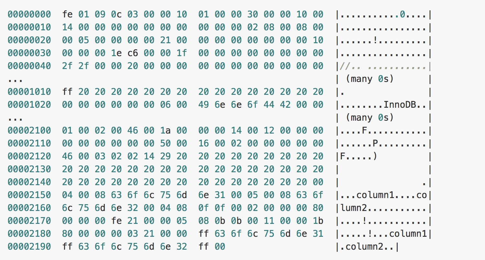
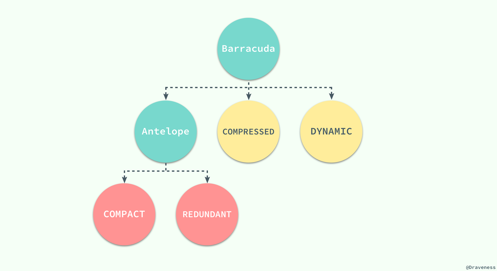

# Mysql Storage Engines

存储引擎是 MySQL 的组件，用于处理不同表类型的 SQL 操作。不同的存储引擎提供不同的存储机制、索引技巧、锁定水平等功能，使用不同的存储引擎，还可以获得特定的功能。

使用哪一种引擎可以灵活选择，**<font color=red>一个数据库中多个表可以使用不同引擎以满足各种性能和实际需求</font>**，使用合适的存储引擎，将会提高整个数据库的性能 。

 MySQL服务器使用可插拔的存储引擎体系结构，可以从运行中的MySQL服务器加载或卸载存储引擎 。

> [MySQL 5.7 可供选择的存储引擎](https://dev.mysql.com/doc/refman/5.7/en/storage-engines.html)

### 查看存储引擎

```mysql
-- 查看支持的存储引擎
SHOW ENGINES

-- 查看默认存储引擎
SHOW VARIABLES LIKE 'storage_engine'

--查看具体某一个表所使用的存储引擎，这个默认存储引擎被修改了！
show create table tablename

--准确查看某个数据库中的某一表所使用的存储引擎
show table status like 'tablename'
show table status from database where name="tablename"
```


### 设置存储引擎

```mysql
-- 建表时指定存储引擎。默认的就是INNODB，不需要设置
CREATE TABLE t1 (i INT) ENGINE = INNODB;
CREATE TABLE t2 (i INT) ENGINE = CSV;
CREATE TABLE t3 (i INT) ENGINE = MEMORY;

-- 修改存储引擎
ALTER TABLE t ENGINE = InnoDB;

-- 修改默认存储引擎，也可以在配置文件my.cnf中修改默认引擎
SET default_storage_engine=NDBCLUSTER;
```

 默认情况下，每当CREATE TABLE或ALTER TABLE不能使用默认存储引擎时，都会生成一个警告。为了防止在所需的引擎不可用时出现令人困惑的意外行为，可以启用`NO_ENGINE_SUBSTITUTION SQL`模式。如果所需的引擎不可用，则此设置将产生错误而不是警告，并且不会创建或更改表 


### 常用存储引擎

#### InnoDB

**InnoDB 是 MySQL5.7 默认的存储引擎，主要特性有**

- InnoDB存储引擎维护自己的缓冲池，在访问数据时将表和索引数据缓存在主内存中 
- 支持事务
- 支持外键
- B-Tree索引
- 不支持集群
- 聚簇索引
- 行锁
- 支持地理位置的数据类型和索引


##### MySQL之Innodb引擎的4大特性

1. 插入缓冲 （Insert Buffer/Change Buffer）
2. 双写机制（Double Write）
3. 自适应哈希索引（Adaptive Hash Index，AHI）
4. 预读 （Read Ahead）


#### MyISAM

在 5.1 版本之前，MyISAM 是 MySQL 的默认存储引擎，MyISAM 并发性比较差，使用的场景比较少，主要特点是

每个MyISAM表存储在磁盘上的三个文件中 。这些文件的名称以表名开头，并有一个扩展名来指示文件类型 。

`.frm`文件存储表的格式。 `.MYD` (`MYData`) 文件存储表的数据。 `.MYI` (`MYIndex`) 文件存储索引。

 **MyISAM表具有以下特征** 

- 每个MyISAM表最大索引数是64，这可以通过重新编译来改变。每个索引最大的列数是16
- 每个MyISAM表都支持一个`AUTO_INCREMENT`的内部列。当执行`INSERT`或者`UPDATE`操作的时候，MyISAM自动更新这个列，这使得`AUTO_INCREMENT`列更快。
-  当把删除和更新及插入操作混合使用的时候，动态尺寸的行产生更少碎片。这要通过合并相邻被删除的块，若下一个块被删除，就扩展到下一块自动完成 

- MyISAM支持**并发插入**
- **可以将数据文件和索引文件放在不同物理设备上的不同目录中**，以更快地使用数据目录和索引目录表选项来创建表 
- BLOB和TEXT列可以被索引
- **NULL被允许在索引的列中**，这个值占每个键的0~1个字节
- 每个字符列可以有不同的字符集
- **`MyISAM` 表使用 B-tree 索引**
- MyISAM表的行最大限制为  (2^32)^2 (1.844E+19)
- 大文件（达到63位文件长度）在支持大文件的文件系统和操作系统上被支持 
- 键的最大长度为1000字节，这也可以通过重新编译来改变，对于键长度超过250字节的情况，一个超过1024字节的键将被用上

- VARCHAR支持固定或动态记录长度
- 表中VARCHAR和CHAR列的长度总和有可能达到64KB 
- 任意长度的唯一约束

- <small>All data values are stored with the low byte first. This makes the data machine and operating system independent. </small>

- <small> All numeric key values are stored with the high byte first to permit better index compression</small> 

  todo：最后两条没搞懂啥意思


### 存储引擎对比

| 对比项   | MyISAM                                                   | InnoDB                                                       |
| -------- | -------------------------------------------------------- | ------------------------------------------------------------ |
| 主外键   | 不支持                                                   | 支持                                                         |
| 事务     | 不支持                                                   | 支持                                                         |
| 行表锁   | 表锁，即使操作一条记录也会锁住整个表，不适合高并发的操作 | 行锁,操作时只锁某一行，不对其它行有影响，<br/>适合高并发的操作 |
| 缓存     | 只缓存索引，不缓存真实数据                               | 不仅缓存索引还要缓存真实数据，对内存要求较高，而且内存大小对性能有决定性的影响 |
| 表空间   | 小                                                       | 大                                                           |
| 关注点   | 性能                                                     | 事务                                                         |
| 默认安装 | 是                                                       | 是                                                           |

 

官方提供的多种引擎对比

| Feature                                    | MyISAM       | Memory           | InnoDB       | Archive      | NDB          |
| ------------------------------------------ | ------------ | ---------------- | ------------ | ------------ | ------------ |
| **B-tree indexes**                         | Yes          | Yes              | Yes          | No           | No           |
| **Backup/point-in-time recovery** (note 1) | Yes          | Yes              | Yes          | Yes          | Yes          |
| **Cluster database support**               | No           | No               | No           | No           | Yes          |
| **Clustered indexes**                      | No           | No               | Yes          | No           | No           |
| **Compressed data**                        | Yes (note 2) | No               | Yes          | Yes          | No           |
| **Data caches**                            | No           | N/A              | Yes          | No           | Yes          |
| **Encrypted data**                         | Yes (note 3) | Yes (note 3)     | Yes (note 4) | Yes (note 3) | Yes (note 3) |
| **Foreign key support**                    | No           | No               | Yes          | No           | Yes (note 5) |
| **Full-text search indexes**               | Yes          | No               | Yes (note 6) | No           | No           |
| **Geospatial data type support**           | Yes          | No               | Yes          | Yes          | Yes          |
| **Geospatial indexing support**            | Yes          | No               | Yes (note 7) | No           | No           |
| **Hash indexes**                           | No           | Yes              | No (note 8)  | No           | Yes          |
| **Index caches**                           | Yes          | N/A              | Yes          | No           | Yes          |
| **Locking granularity**                    | Table        | Table            | Row          | Row          | Row          |
| **MVCC**                                   | No           | No               | Yes          | No           | No           |
| **Replication support** (note 1)           | Yes          | Limited (note 9) | Yes          | Yes          | Yes          |
| **Storage limits**                         | 256TB        | RAM              | 64TB         | None         | 384EB        |
| **T-tree indexes**                         | No           | No               | No           | No           | Yes          |
| **Transactions**                           | No           | No               | Yes          | No           | Yes          |
| **Update statistics for data dictionary**  | Yes          | Yes              | Yes          | Yes          | Yes          |


### 数据的存储

在整个数据库体系结构中，我们可以使用不同的存储引擎来存储数据，而绝大多数存储引擎都以二进制的形式存储数据；这一节会介绍 InnoDB 中对数据是如何存储的。

在 InnoDB 存储引擎中，所有的数据都被逻辑地存放在表空间中，表空间（tablespace）是存储引擎中最高的存储逻辑单位，在表空间的下面又包括段（segment）、区（extent）、页（page）

  

 同一个数据库实例的所有表空间都有相同的页大小；默认情况下，表空间中的页大小都为 16KB，当然也可以通过改变 `innodb_page_size` 选项对默认大小进行修改，需要注意的是不同的页大小最终也会导致区大小的不同 


从图中可以看出，在 InnoDB 存储引擎中，一个区的大小最小为 1MB，页的数量最少为 64 个。


#### 如何存储表

MySQL 使用 InnoDB 存储表时，会将表的定义和数据索引等信息分开存储，其中前者存储在 `.frm` 文件中，后者存储在 `.ibd` 文件中，这一节就会对这两种不同的文件分别进行介绍。


#### .frm 文件

无论在 MySQL 中选择了哪个存储引擎，所有的 MySQL 表都会在硬盘上创建一个 `.frm` 文件用来描述表的格式或者说定义；`.frm` 文件的格式在不同的平台上都是相同的。

```mysql
`CREATE TABLE test_frm(``  ``column1 CHAR(5),``  ``column2 INTEGER``);`
```

当我们使用上面的代码创建表时，会在磁盘上的 `datadir` 文件夹中生成一个 `test_frm.frm` 的文件，这个文件中就包含了表结构相关的信息：



> MySQL 官方文档中的 [11.1 MySQL .frm File Format](https://dev.mysql.com/doc/internals/en/frm-file-format.html) 一文对于 `.frm` 文件格式中的二进制的内容有着非常详细的表述。

#### .ibd 文件

InnoDB 中用于存储数据的文件总共有两个部分，一是系统表空间文件，包括 `ibdata1`、`ibdata2` 等文件，其中存储了 InnoDB 系统信息和用户数据库表数据和索引，是所有表公用的。

当打开 `innodb_file_per_table` 选项时，`.ibd` 文件就是每一个表独有的表空间，文件存储了当前表的数据和相关的索引数据。

#### 如何存储记录

与现有的大多数存储引擎一样，InnoDB 使用页作为磁盘管理的最小单位；数据在 InnoDB 存储引擎中都是按行存储的，每个 16KB 大小的页中可以存放 2-7992 行的记录。（至少是2条记录，最多是7992条记录）

当 InnoDB 存储数据时，它可以使用不同的行格式进行存储；MySQL 5.7 版本支持以下格式的行存储方式：



Antelope 是 InnoDB 最开始支持的文件格式，它包含两种行格式 Compact 和 Redundant，它最开始并没有名字；Antelope 的名字是在新的文件格式 Barracuda 出现后才起的，Barracuda 的出现引入了两种新的行格式 Compressed 和 Dynamic；InnoDB 对于文件格式都会向前兼容，而官方文档中也对之后会出现的新文件格式预先定义好了名字：Cheetah、Dragon、Elk 等等。

两种行记录格式 Compact 和 Redundant 在磁盘上按照以下方式存储：


Compact 和 Redundant 格式最大的不同就是记录格式的第一个部分；在 Compact 中，行记录的第一部分倒序存放了一行数据中列的长度（Length），而 Redundant 中存的是每一列的偏移量（Offset），从总体上看，Compact 行记录格式相比 Redundant 格式能够减少 20% 的存储空间。

#### 行溢出数据

当 InnoDB 使用 Compact 或者 Redundant 格式存储极长的 VARCHAR 或者 BLOB 这类大对象时，我们并不会直接将所有的内容都存放在数据页节点中，而是将行数据中的前 768 个字节存储在数据页中，后面会通过偏移量指向溢出页。


但是当我们使用新的行记录格式 Compressed 或者 Dynamic 时都只会在行记录中保存 20 个字节的指针，实际的数据都会存放在溢出页面中。


当然在实际存储中，可能会对不同长度的 TEXT 和 BLOB 列进行优化，不过这就不是本文关注的重点了。

> 想要了解更多与 InnoDB 存储引擎中记录的数据格式的相关信息，可以阅读 [InnoDB Record Structure](https://dev.mysql.com/doc/internals/en/innodb-record-structure.html)

#### 数据页结构

页是 InnoDB 存储引擎管理数据的最小磁盘单位，而 B-Tree 节点就是实际存放表中数据的页面，我们在这里将要介绍页是如何组织和存储记录的；首先，一个 InnoDB 页有以下七个部分：


每一个页中包含了两对 header/trailer：内部的 Page Header/Page Directory 关心的是页的状态信息，而 Fil Header/Fil Trailer 关心的是记录页的头信息。

在页的头部和尾部之间就是用户记录和空闲空间了，每一个数据页中都包含 Infimum 和 Supremum 这两个虚拟的记录（可以理解为占位符），Infimum 记录是比该页中任何主键值都要小的值，Supremum 是该页中的最大值：


User Records 就是整个页面中真正用于存放行记录的部分，而 Free Space 就是空余空间了，它是一个链表的数据结构，为了保证插入和删除的效率，整个页面并不会按照主键顺序对所有记录进行排序，它会自动从左侧向右寻找空白节点进行插入，行记录在物理存储上并不是按照顺序的，它们之间的顺序是由 `next_record` 这一指针控制的。

B+ 树在查找对应的记录时，并不会直接从树中找出对应的行记录，它只能获取记录所在的页，将整个页加载到内存中，再通过 Page Directory 中存储的稀疏索引和 `n_owned`、`next_record` 属性取出对应的记录，不过因为这一操作是在内存中进行的，所以通常会忽略这部分查找的耗时。

InnoDB 存储引擎中对数据的存储是一个非常复杂的话题，这一节中也只是对表、行记录以及页面的存储进行一定的分析和介绍，虽然作者相信这部分知识对于大部分开发者已经足够了，但是想要真正消化这部分内容还需要很多的努力和实践。


> [踏雪无痕-InnoDB存储引擎](https://www.cnblogs.com/chenpingzhao/p/9177324.html) 