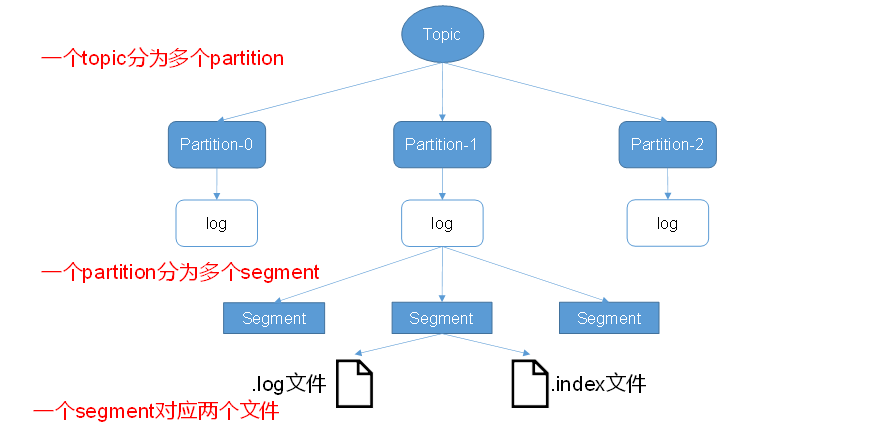
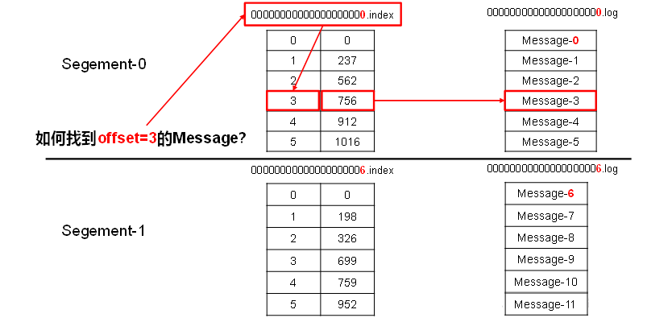
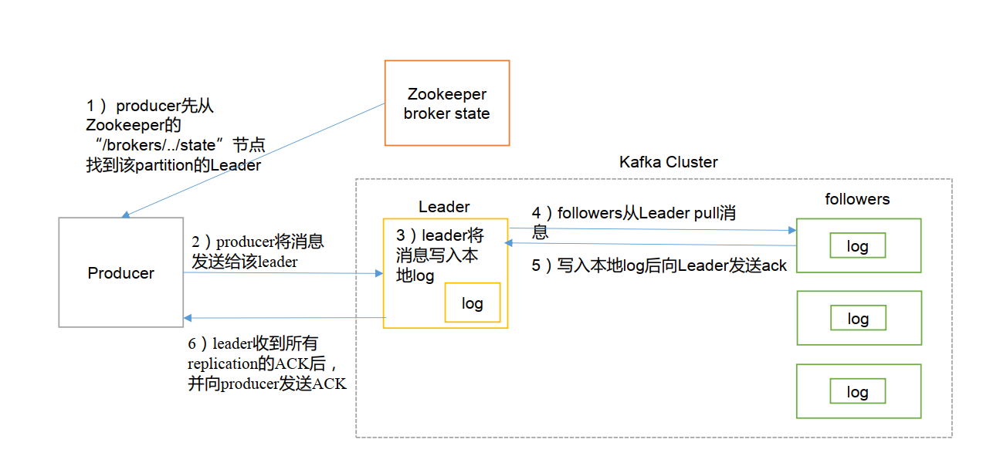
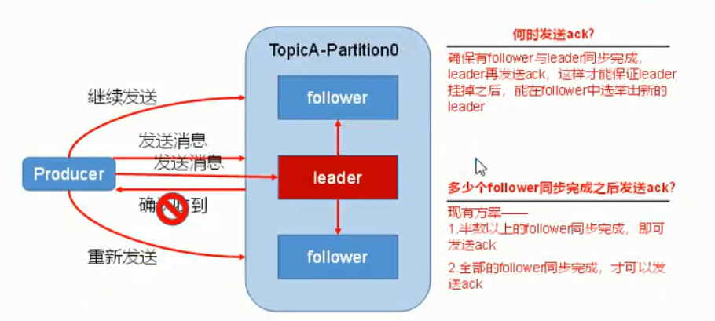
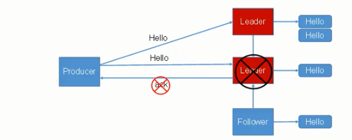
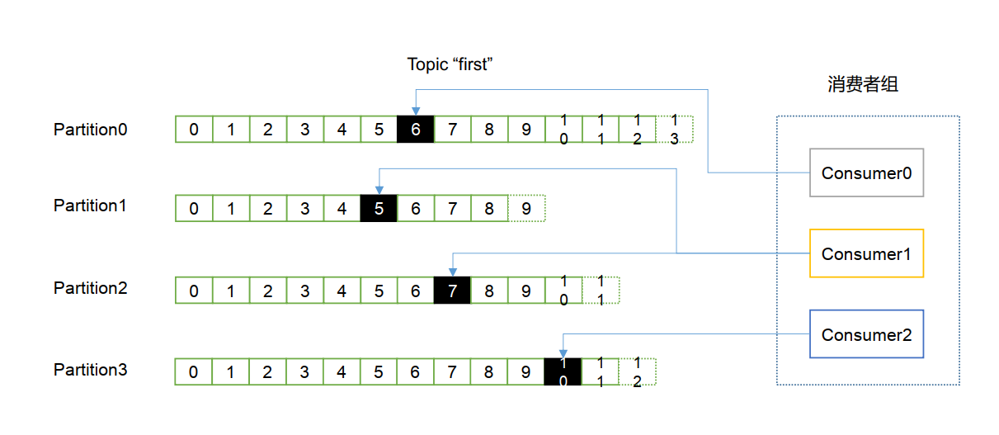
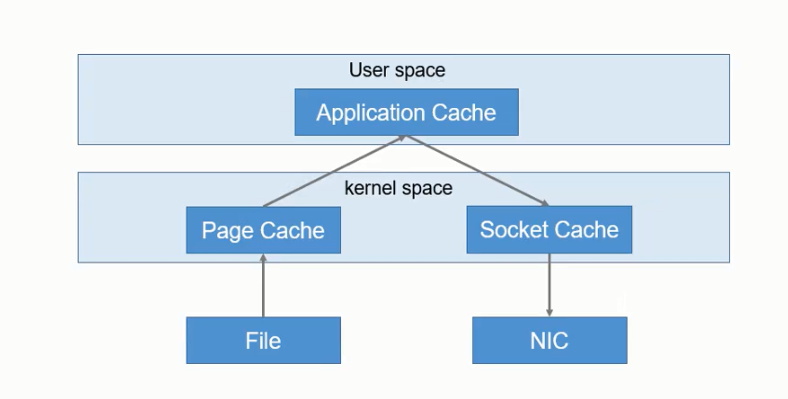
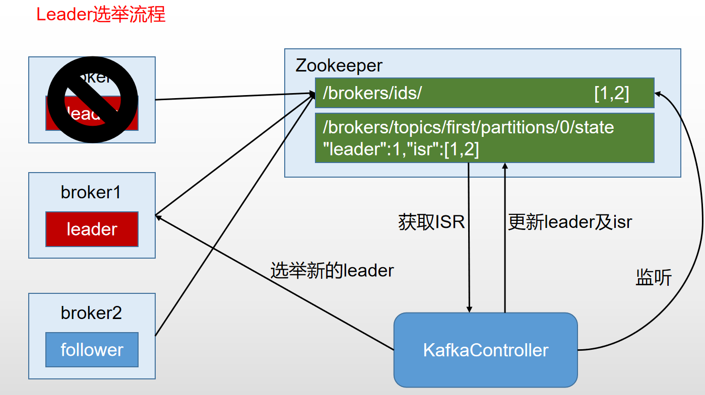

## 1. Kafka概述

### 1.1 定义

Kafka 是一个**分布式**的基于**发布/订阅模式的消息队列**（Message Queue），主要应用于大数据实时处理领域。


### 1.2 消息队列 

#### 1.2.1 传统消息队列的应用场景

 

#### 1.2.2 为什么需要消息队列

1. **解耦**： 允许你独立的扩展或修改两边的处理过程，只要确保它们遵守同样的接口约束。
2. **冗余**：消息队列把数据进行持久化直到它们已经被完全处理，通过这一方式规避了数据丢失风险。许多消息队列所采用的"插入-获取-删除"范式中，在把一个消息从队列中删除之前，需要你的处理系统明确的指出该消息已经被处理完毕，从而确保你的数据被安全的保存直到你使用完毕。 
3. **扩展性**： 因为消息队列解耦了你的处理过程，所以增大消息入队和处理的频率是很容易的，只要另外增加处理过程即可。 
4. **灵活性 & 峰值处理能力**： 在访问量剧增的情况下，应用仍然需要继续发挥作用，但是这样的突发流量并不常见。 如果为以能处理这类峰值访问为标准来投入资源随时待命无疑是巨大的浪费。使用消息队列能够使关键组件顶住突发的访问压力，而不会因为突发的超负荷的请求而完全崩溃。 
5. **可恢复性**： 系统的一部分组件失效时，不会影响到整个系统。消息队列降低了进程间的耦合度，所以即使一个处理消息的进程挂掉，加入队列中的消息仍然可以在系统恢复后被处理。
6. **顺序保证**： 在大多使用场景下，数据处理的顺序都很重要。大部分消息队列本来就是排序的，并且能保证数据会按照特定的顺序来处理。（Kafka 保证一个 Partition 内的消息的有序性）
7. **缓冲**： 有助于控制和优化数据流经过系统的速度， 解决生产消息和消费消息的处理速度不一致的情况。 
8. **异步通信**： 很多时候，用户不想也不需要立即处理消息。消息队列提供了异步处理机制，允许用户把一个消息放入队列，但并不立即处理它。想向队列中放入多少消息就放多少，然后在需要的时候再去处理它们。


#### 1.2.3 消息队列的两种模式

- **点对点模式**（一对一，消费者主动拉取数据，消息收到后消息清除）

  消息生产者生产消息发送到 Queue 中，然后消息消费者从 Queue 中取出并且消费消息。 消息被消费以后，queue 中不再有存储，所以消息消费者不可能消费到已经被消费的消息。 Queue 支持存在多个消费者，但是对一个消息而言，只会有一个消费者可以消费。

  

- **发布/订阅模式**（一对多，数据生产后，推送给所有订阅者） 

  消息生产者（发布）将消息发布到 topic 中，同时有多个消息消费者（订阅）消费该消 息。和点对点方式不同，发布到 topic 的消息会被所有订阅者消费。

  


### 1.3 Kafka 基础架构图


- Producer ：消息生产者，就是向 kafka broker 发消息的客户端；
- Consumer ：消息消费者，向 kafka broker 取消息的客户端；
- Consumer Group （CG）：消费者组，由多个 consumer 组成。**消费者组内每个消费者负责消费不同分区的数据，一个分区只能由一个组内消费者消费；消费者组之间互不影响**。所有的消费者都属于某个消费者组，即消费者组是逻辑上的一个订阅者。 
- Broker ：一台 kafka 服务器就是一个 broker。一个集群由多个 broker 组成。一个 broker 可以容纳多个 topic。 
- Topic ：可以理解为一个队列，Kafka 的消息通过 Topics(主题) 进行分类，生产者和消费者面向的都是一个 topic； 
- Partition：为了实现扩展性，一个非常大的 topic 可以分布到多个 broker（即服务器）上， 一个 topic 可以分为多个 partition，每个 partition 是一个有序的队列； partition 中的每条消息 都会被分配一个有序的 id（ offset）。 kafka 只保证按一个 partition 中的顺序将消息发给 consumer，不保证一个 topic 的整体（多个 partition 间）的顺序； 
- Replica：副本，为保证集群中的某个节点发生故障时，该节点上的 partition 数据不丢失，且 kafka 仍然能够继续工作，kafka 提供了副本机制，一个 topic 的每个分区都有若干个副本， 一个 leader 和若干个 follower。 
- leader：每个分区多个副本的“主”，生产者发送数据的对象，以及消费者消费数据的对象都是 leader。 
- follower：每个分区多个副本中的“从”，实时从 leader 中同步数据，保持和 leader 数据的同步。leader 发生故障时，某个 follower 会成为新的 follower。
- Offset： kafka 的存储文件都是按照 offset.kafka 来命名，用 offset 做名字的好处是方便查找。例如你想找位于 2049 的位置，只要找到 2048.kafka 的文件即可。当然 the first offset 就是 00000000000.kafka。

------


## 2. Hello Kafka

### 2.1 动起手来

[Quickstart](<https://kafka.apache.org/quickstart> )

[中文版入门指南](<http://ifeve.com/kafka-1/> )

### 2.2 基本概念(官方介绍翻译)

Kafka是一个分布式的流处理平台。是支持分区的（partition）、多副本的（replica），基于 ZooKeeper 协调的分布式消息系统，它的最大的特性就是可以实时的处理大量数据以满足各种需求场景：比如基于 hadoop 的批处理系统、低延迟的实时系统、storm/Spark 流式处理引擎，web/nginx 日志、访问日志，消息服务等等 

#### 有三个关键能力

- 它可以让你发布和订阅记录流。在这方面，它类似于一个消息队列或企业消息系统
- 它可以让你持久化收到的记录流，从而具有容错能力。
- 它可以让你处理收到的记录流。

#### 应用于两大类应用

- 构建实时的流数据管道，可靠地获取系统和应用程序之间的数据。
- 构建实时流的应用程序，对数据流进行转换或反应。

想要了解 Kafka 如何具有这些能力，首先，明确几个概念：

- Kafka 作为一个集群运行在一个或多个服务器上。
- Kafka  集群存储的消息是以主题（topics）为类别记录的。
- 每个消息记录包含一个键，一个值和时间戳。

#### Kafka有五个核心API：

- **Producer API** 允许应用程序发布记录流至一个或多个Kafka的话题(Topics)。

- **Consumer API**允许应用程序订阅一个或多个主题，并处理这些主题接收到的记录流。

- **Streams API**允许应用程序充当流处理器（stream processor），从一个或多个主题获取输入流，并生产一个输出流至一个或多个的主题，能够有效地变换输入流为输出流。

- **Connector API**允许构建和运行可重用的生产者或消费者，能够把 Kafka主题连接到现有的应用程序或数据系统。例如，一个连接到关系数据库的连接器(connector)可能会获取每个表的变化。

- **Admin API**允许管理和检查主题、brokes 和其他 Kafka 对象。（这个是新版本才有的）

  

Kafka 的客户端和服务器之间的通信是靠一个简单的，高性能的，与语言无关的 TCP 协议完成的。这个协议有不同的版本，并保持向后兼容旧版本。Kafka 不光提供了一个 Java 客户端，还有许多语言版本的客户端。

#### 主题和日志

主题是同一类别的消息记录（record）的集合。Kafka的主题支持多用户订阅，也就是说，一个主题可以有零个，一个或多个消费者订阅写入的数据。对于每个主题，Kafka集群都会维护一个分区日志，如下所示：


**每个分区是一个有序的，不可变的消息序列**，新的消息不断追加到 partition 的末尾。在每个 partition 中，每条消息都会被分配一个顺序的唯一标识，这个标识被称为 **offset**，即偏移量。**kafka不能保证全局有序，只能保证分区内有序** 。

Kafka 集群保留所有发布的记录，不管这个记录有没有被消费过，Kafka 提供可配置的保留策略去删除旧数据(还有一种策略根据分区大小删除数据)。例如，如果将保留策略设置为两天，在数据发布后两天，它可用于消费，之后它将被丢弃以腾出空间。Kafka 的性能跟存储的数据量的大小无关（会持久化到硬盘）， 所以将数据存储很长一段时间是没有问题的。


事实上，在单个消费者层面上，每个消费者保存的唯一的元数据就是它所消费的数据日志文件的偏移量。偏移量是由消费者来控制的，通常情况下，消费者会在读取记录时线性的提高其偏移量。不过由于偏移量是由消费者控制，所以消费者可以将偏移量设置到任何位置，比如设置到以前的位置对数据进行重复消费，或者设置到最新位置来跳过一些数据。

#### 分布式

日志的分区会跨服务器的分布在 Kafka 集群中，每个服务器会共享分区进行数据请求的处理。**每个分区可以配置一定数量的副本分区提供容错能力。**

**每个分区都有一个服务器充当“leader”和零个或多个服务器充当“followers”**。 leader 处理所有的读取和写入分区的请求，而 followers 被动的从领导者拷贝数据。如果 leader 失败了，followers 之一将自动成为新的领导者。每个服务器可能充当一些分区的 leader 和其他分区的 follower，所以 Kafka 集群内的负载会比较均衡。

#### 生产者

生产者发布数据到他们所选择的主题。生产者负责选择把记录分配到主题中的哪个分区。这可以使用轮询算法( round-robin)进行简单地平衡负载，也可以根据一些更复杂的语义分区算法（比如基于记录一些键值）来完成。

#### 消费者

消费者以消费群（**consumer group** ）的名称来标识自己，每个发布到主题的消息都会发送给订阅了这个主题的消费群里面的一个消费者的一个实例。消费者的实例可以在单独的进程或单独的机器上。

如果所有的消费者实例都属于相同的消费群，那么记录将有效地被均衡到每个消费者实例。

如果所有的消费者实例有不同的消费群，那么每个消息将被广播到所有的消费者进程。

这是 kafka 用来实现一个 topic 消息的广播（发给所有的consumer） 和单播（发给任意一个 consumer）的手段。一个 topic 可以有多个 CG。 topic 的消息会复制 （不是真的复制，是概念上的）到所有的 CG，但每个 partion 只会把消息发给该 CG 中的一 个 consumer。如果需要实现广播，只要每个 consumer 有一个独立的 CG 就可以了。要实现单播只要所有的 consumer 在同一个 CG。用 CG 还可以将 consumer 进行自由的分组而不需 要多次发送消息到不同的 topic； 


举个栗子：

如上图所示，一个两个节点的 Kafka 集群上拥有一个四个 partition（P0-P3）的 topic。有两个消费者组都在消费这个 topic 中的数据，消费者组 A 有两个消费者实例，消费者组 B 有四个消费者实例。

从图中我们可以看到，在同一个消费者组中，每个消费者实例可以消费多个分区，但是每个分区最多只能被消费者组中的一个实例消费。也就是说，如果有一个4个分区的主题，那么消费者组中最多只能有4个消费者实例去消费，多出来的都不会被分配到分区。其实这也很好理解，如果允许两个消费者实例同时消费同一个分区，那么就无法记录这个分区被这个消费者组消费的 offset 了。如果在消费者组中动态的上线或下线消费者，那么 Kafka 集群会自动调整分区与消费者实例间的对应关系。

**Kafka消费群的实现方式是通过分割日志的分区，分给每个 Consumer 实例，使每个实例在任何时间点的都可以“公平分享”独占的分区**。维持消费群中的成员关系的这个过程是通过Kafka动态协议处理。如果新的实例加入该组，他将接管该组的其他成员的一些分区; 如果一个实例死亡，其分区将被分配到剩余的实例。

Kafka 只保证一个分区内的消息有序，不能保证一个主题的不同分区之间的消息有序。分区的消息有序与依靠主键进行数据分区的能力相结合足以满足大多数应用的要求。但是，如果你想要保证所有的消息都绝对有序可以只为一个主题分配一个分区，虽然这将意味着每个消费群同时只能有一个消费进程在消费。

#### 保证

Kafka提供了以下一些高级别的保证：	

- 由生产者发送到一个特定的主题分区的消息将被以他们被发送的顺序来追加。也就是说，如果一个消息M1和消息M2都来自同一个生产者，M1先发，那么M1将有一个低于M2的偏移，会更早在日志中出现。
- 消费者看到的记录排序就是记录被存储在日志中的顺序。
- 对于副本因子N的主题，我们将承受最多N-1次服务器故障切换而不会损失任何的已经保存的记录。


### 3.2 Kafka的使用场景

#### 消息

Kafka 被当作传统消息中间件的替代品。消息中间件的使用原因有多种（从数据生产者解耦处理，缓存未处理的消息等）。与大多数消息系统相比，Kafka 具有更好的吞吐量，内置的分区，多副本和容错功能，这使其成为大规模消息处理应用程序的良好解决方案。

#### 网站行为跟踪

Kafka 的初衷就是能够将用户行为跟踪管道重构为一组实时发布-订阅数据源。这意味着网站活动（页面浏览量，搜索或其他用户行为）将被发布到中心主题，这些中心主题是每个用户行为类型对应一个主题的。这些数据源可被订阅者获取并用于一系列的场景，包括实时处理，实时监控和加载到 Hadoop 或离线数据仓库系统中进行离线处理和报告。用户行为跟踪通常会产生巨大的数据量，因为用户每个页面的浏览都会生成许多行为活动消息。

#### 测量

Kafka通常用于监测数据的处理。这涉及从分布式应用程序聚集统计数据，生产出集中的运行数据源feeds（以便订阅）。

#### 日志聚合

许多人用 Kafka 作为日志聚合解决方案的替代品。日志聚合通常从服务器收集物理日志文件，并将它们集中放置（可能是文件服务器或HDFS），以便后续处理。kafka 抽象出文件的细节，并将日志或事件数据作为消息流清晰地抽象出来。这为低时延的处理提供支持，而且更容易支持多个数据源和分布式的数据消费。相比集中式的日志处理系统（如Scribe或Flume），Kafka 性能同样出色，而且因为副本备份提供了更强的可靠性保证和更低的端到端延迟。

#### 流处理

Kafka 的流数据管道在处理数据的时候包含多个阶段，其中原始输入数据从 Kafka 主题被消费然后汇总，加工，或转化成新主题用于进一步的消费或后续处理。例如，用于推荐新闻文章的数据流处理管道可能从 RSS 源抓取文章内容，并将其发布到“文章”主题; 进一步的处理可能是标准化或删除重复数据，然后发布处理过的文章内容到一个新的主题， 最后的处理阶段可能会尝试推荐这个内容给用户。这种处理管道根据各个主题创建实时数据流图。从版本 0.10.0.0 开始，Apache Kafka 加入了轻量级的但功能强大的流处理库**Kafka Streams**，Kafka Streams支持如上所述的数据处理。除了Kafka Streams，可以选择的开源流处理工具包括 Apache Storm and Apache Samza。

#### 事件源

事件源是一种应用程序设计风格，是按照时间顺序记录的状态变化的序列。Kafka的非常强大的存储日志数据的能力使它成为构建这种应用程序的极好的后端选择。

#### 提交日志

Kafka 可以为分布式系统提供一种外部提交日志(commit-log)服务。日志有助于节点之间复制数据，并作为一种数据重新同步机制用来恢复故障节点的数据。Kafka的 log compaction 功能有助于支持这种用法。Kafka在这种用法中类似于Apache BookKeeper 项目。


在流式计算中， Kafka 一般用来缓存数据， Storm 通过消费 Kafka 的数据进行计算。

-  Kafka 作为一个分布式消息队列。 Kafka 对消息保存时根据 Topic 进行归类，发送消息 者称为 Producer，消息接受者称为 Consumer，此外 kafka 集群由多个 kafka 实例组成，每个实例(server)称为 broker。 
-  无论是 kafka 集群，还是 consumer 都依赖于 zookeeper 集群保存一些 meta 信息， 来保证系统可用性。  
-  Kafka的客户端和服务器之间的通信是靠一个简单的，高性能的，与语言无关的[TCP协议](https://kafka.apache.org/protocol.html)完成的。这个协议有不同的版本，并保持向后兼容旧版本。Kafka不光提供了一个Java客户端，还有[许多语言版本的客户端。 

------


## 3. Kafka架构深入

### 3.1 Kafka 工作流程和文件存储机制    


#### topic构成

**Kafka 中消息是以 topic 进行分类的**，生产者生产消息，消费者消费消息，都是面向 topic 的。

**topic 是逻辑上的概念，而 patition 是物理上的概念**，每个 patition 对应一个 log 文件，而 log 文件中存储的就是 producer 生产的数据，patition 生产的数据会被不断的添加到 log 文件的末端，且每条数据都有自己的 offset。消费组中的每个消费者，都是实时记录自己消费到哪个 offset，以便出错恢复，从上次的位置继续消费。




#### 消息存储原理

由于生产者生产的消息会不断追加到 log 文件末尾，为防止 log 文件过大导致数据定位效率低下，Kafka 采取了**分片**和**索引**机制，将每个 partition 分为多个 segment。每个segment对应两个文件——`.index文件`和 `.log文件`。这些文件位于一个文件夹下，该文件夹的命名规则为：topic名称+分区序号。例如，first 这个 topic 有三个分区，则其对应的文件夹为 first-0，first-1，first-2。


这些文件的含义如下：

| 类别                    | 作用                                                         |
| :---------------------- | :----------------------------------------------------------- |
| .index                  | 偏移量索引文件，存储数据对应的偏移量                         |
| .timestamp              | 时间戳索引文件                                               |
| .log                    | 日志文件，存储生产者生产的数据                               |
| .snaphot                | 快照文件                                                     |
|                         |                                                              |
| Leader-epoch-checkpoint | 保存了每一任leader开始写入消息时的offset，会定时更新。 follower被选为leader时会根据这个确定哪些消息可用 |

index 和 log 文件以当前 segment 的第一条消息的 offset 命名。偏移量 offset 是一个64位的长整形数，固定是20位数字，长度未达到，用0进行填补，索引文件和日志文件都由此作为文件名命名规则。所以从上图可以看出，我们的偏移量是从0开始的，`.index`和`.log`文件名称都为 `00000000000000000000`。下图为 index 文件和 log 文件的结构示意图。 



`.index文件` 存储大量的索引信息，`.log文件` 存储大量的数据，索引文件中的元数据指向对应数据文件中 message 的物理偏移地址。


上节中，我们通过生产者发送了hello和world两个数据，所以我们可以查看下.log文件下是否有这两条数据：


内容存在一些”乱码“，因为数据是经过序列化压缩的。

那么数据文件.log大小有限制吗，能保存多久时间？这些我们都可以通过Kafka目录下conf/server.properties配置文件修改：

```
# log文件存储时间，单位为小时，这里设置为1周
log.retention.hours=168

# log文件大小的最大值，这里为1g，超过这个值，则会创建新的segment（也就是新的.index和.log文件）
log.segment.bytes=1073741824
```


比如，当生产者生产数据量较多，一个segment存储不下触发分片时，在日志topic目录下你会看到类似如下所示的文件：

```
00000000000000000000.index
00000000000000000000.log
00000000000000170410.index
00000000000000170410.log
00000000000000239430.index
00000000000000239430.log
```


下图展示了Kafka查找数据的过程：


比如现在要查找偏移量offset为3的消息，根据.index文件命名我们可以知道，offset为3的索引应该从00000000000000000000.index里查找。根据上图所示，其对应的索引地址为756~911，所以Kafka将读取00000000000000000000.log 756~911区间的数据。

### 3.2 Kafka 生产过程    

#### 3.2.1 写入流程

producer 写入消息流程如下： 




1. producer 先从 zookeeper 的 "/brokers/.../state"节点找到该 partition 的 leader
2. producer 将消息发送给该 leader 
3. leader 将消息写入本地 log 
4. followers 从 leader pull 消息，写入本地 log 后向 leader 发送 ACK    
5. leader 收到所有 ISR 中的 replication 的 ACK 后，增加 HW（high watermark，最后 commit 的 offset）并向 producer 发送 ACK 

#### 3.2.2 写入方式 

producer 采用推（push） 模式将消息发布到 broker，每条消息都被追加（append） 到分区（patition） 中，属于顺序写磁盘（顺序写磁盘效率比随机写内存要高，保障 kafka 吞吐率）。

####  3.2.3 分区（Partition） 

消息发送时都被发送到一个 topic，其本质就是一个目录，而 topic 是由一些 Partition Logs(分区日志)组成

**分区的原因：**

1. **方便在集群中扩展**，每个 Partition 可以通过调整以适应它所在的机器，而一个 topic 又可以有多个 Partition 组成，因此整个集群就可以适应任意大小的数据了；

2. **可以提高并发**，因为可以以 Partition 为单位读写了。 

**分区的原则：** 

我们需要将 producer 发送的数据封装成一个 ProducerRecord 对象。

```java
public ProducerRecord (String topic, Integer partition, Long timestamp, K key, V value, Iterable<Header> headers)
public ProducerRecord (String topic, Integer partition, Long timestamp, K key, V value)
public ProducerRecord (String topic, Integer partition, K key, V value, Iterable<Header> headers)
public ProducerRecord (String topic, Integer partition, K key, V value)
public ProducerRecord (String topic, K key, V value)
public ProducerRecord (String topic, V value)
```

1. 指明 partition 的情况下，直接将指明的值直接作为 partiton 值； 
2. 没有指明 partition 值但有 key 的情况下，将 key 的 hash 值与 topic 的 partition 数进行取余得到 partition 值； 
3. 既没有 partition 值又没有 key 值的情况下，第一次调用时随机生成一个整数（后面每次调用在这个整数上自增），将这个值与 topic 可用的 partition 总数取余得到 partition 值，也就是常说的 round-robin 算法。  


#### 3.2.4 副本（Replication）

同一个 partition 可能会有多个 replication（ 对应 server.properties 配置中的 default.replication.factor=N）。没有 replication 的情况下，一旦 broker 宕机，其上所有 patition 的数据都不可被消费，同时 producer 也不能再将数据存于其上的 patition。引入 replication 之后，同一个 partition 可能会有多个 replication，而这时需要在这些 replication 之间选出一 个 leader， producer 和 consumer 只与这个 leader 交互，其它 replication 作为 follower 从 leader 中复制数据。

#### 3.2.5 数据可靠性保证

为保证 producer 发送的数据，能可靠的发送到指定的 topic，topic 的每个 partition 收到 producer 数据后，都需要向 producer 发送 ack（acknowledgement确认收到），如果 producer 收到 ack，就会进行下一轮的发送，否则重新发送数据。



##### a) 副本数据同步策略

| 方案                        | 优点                                               | 缺点                                                  |
| --------------------------- | -------------------------------------------------- | ----------------------------------------------------- |
| 半数以上完成同步，就发送ack | 延迟低                                             | 选举新的 leader 时，容忍n台节点的故障，需要2n+1个副本 |
| 全部完成同步，才发送ack     | 选举新的leader时，容忍n台节点的故障，需要n+1个副本 | 延迟高                                                |

Kafka选择了第二种方案，原因如下：

- 同样为了容忍n台节点的故障，第一种方案需要的副本数相对较多，而 Kafka 的每个分区都有大量的数据，第一种方案会造成大量的数据冗余；
- 虽然第二种方案的网络延迟会比较高，但网络延迟对 Kafka 的影响较小。

##### b) ISR

采用第二种方案之后，设想一下情景：leader 收到数据，所有 follower 都开始同步数据，但有一个 follower 挂了，迟迟不能与 leader 保持同步，那 leader 就要一直等下去，直到它完成同步，才能发送 ack，这个问题怎么解决呢？

leader 维护了一个动态的 **in-sync replica set**(ISR)，意为和 leader 保持同步的 follower 集合。当 ISR 中的follower 完成数据的同步之后，leader 就会给 follower 发送 ack。如果 follower 长时间未向 leader 同步数据，则该 follower 将会被踢出 ISR，该时间阈值由 `replica.lag.time.max.ms` 参数设定。leader 发生故障之后，就会从 ISR 中选举新的 leader。（之前还有另一个参数，0.9 版本之后 `replica.lag.max.messages` 参数被移除了）

##### c) ack应答机制

对于某些不太重要的数据，对数据的可靠性要求不是很高，能够容忍数据的少量丢失，所以没必要等 ISR 中的follower全部接收成功。

所以Kafka为用户提供了**三种可靠性级别**，用户根据对可靠性和延迟的要求进行权衡，选择以下的配置。

**acks参数配置：**

- **acks:**

  0：producer 不等待 broker 的 ack，这一操作提供了一个最低的延迟，broker 一接收到还没有写入磁盘就已经返回，当 broker 故障时有可能**丢失数据**；

  1：producer 等待 broker 的 ack，partition 的 leader 落盘成功后返回 ack，如果在 follower 同步成功之前 leader 故障，那么将会**丢失数据**（下图为acks=1数据丢失案例）；


-1（all）：producer 等待 broker 的 ack，partition 的 leader 和 follower 全部落盘成功后才返回 ack。但是	如果在 follower 同步完成后，broker 发送 ack 之前，leader 发生故障，那么就会造成**数据重复**。（下图为acks=-1数据重复案例）



##### d) 故障处理

由于我们并不能保证 Kafka 集群中每时每刻 follower 的长度都和 leader 一致（即数据同步是有时延的），那么当leader 挂掉选举某个 follower 为新的 leader 的时候（原先挂掉的 leader 恢复了成为了 follower），可能会出现leader 的数据比 follower 还少的情况。为了解决这种数据量不一致带来的混乱情况，Kafka 提出了以下概念：


- LEO（Log End Offset）：指的是每个副本最后一个offset；
- HW（High Wather）：指的是消费者能见到的最大的 offset，ISR 队列中最小的 LEO。

消费者和leader通信时，只能消费 HW 之前的数据，HW 之后的数据对消费者不可见。

针对这个规则：

- **当follower发生故障时**：follower 发生故障后会被临时踢出 ISR，待该 follower 恢复后，follower 会读取本地磁盘记录的上次的 HW，并将 log 文件高于 HW 的部分截取掉，从 HW 开始向 leader 进行同步。等该 follower 的 LEO 大于等于该 Partition 的 HW，即 follower 追上 leader 之后，就可以重新加入 ISR 了。
- **当leader发生故障时**：leader 发生故障之后，会从 ISR 中选出一个新的 leader，之后，为保证多个副本之间的数据一致性，其余的 follower 会先将各自的 log 文件高于 HW 的部分截掉，然后从新的 leader 同步数据。

所以数据一致性并不能保证数据不丢失或者不重复，这是由 ack 控制的。HW 规则只能保证副本之间的数据一致性！

#### 3.2.6 Exactly Once语义

将服务器的 ACK 级别设置为 -1，可以保证 Producer 到 Server 之间不会丢失数据，即 At Least Once 语义。相对的，将服务器 ACK 级别设置为 0，可以保证生产者每条消息只会被发送一次，即 At Most Once语义。

**At Least Once 可以保证数据不丢失，但是不能保证数据不重复。相对的，At Least Once 可以保证数据不重复，但是不能保证数据不丢失**。但是，对于一些非常重要的信息，比如说交易数据，下游数据消费者要求数据既不重复也不丢失，即 Exactly Once 语义。在 0.11 版本以前的 Kafka，对此是无能为力的，只能保证数据不丢失，再在下游消费者对数据做全局去重。对于多个下游应用的情况，每个都需要单独做全局去重，这就对性能造成了很大的影响。

0.11 版本的 Kafka，引入了一项重大特性：**幂等性**。所谓的幂等性就是指 Producer 不论向 Server 发送多少次重复数据。Server 端都会只持久化一条，幂等性结合 At Least Once 语义，就构成了 Kafka 的 Exactily Once 语义，即： **<u>At Least Once + 幂等性 = Exactly Once</u>**

要启用幂等性，只需要将 Producer 的参数中 `enable.idompotence` 设置为 `true` 即可。Kafka 的幂等性实现其实就是将原来下游需要做的去重放在了数据上游。开启幂等性的 Producer 在初始化的时候会被分配一个 PID，发往同一 Partition 的消息会附带 Sequence Number。而 Broker 端会对 <PID,Partition,SeqNumber> 做缓存，当具有相同主键的消息提交时，Broker 只会持久化一条。

但是 PID 重启就会变化，同时不同的 Partition 也具有不同主键，所以幂等性无法保证跨分区会话的 Exactly Once。


### 3.3 Broker 保存消息

#### 3.3.1 存储方式 

物理上把 topic 分成一个或多个 patition（对应 server.properties 中的 num.partitions=3 配 置），每个 patition 物理上对应一个文件夹（该文件夹存储该 patition 的所有消息和索引文件）。    

#### 3.3.2 存储策略 

无论消息是否被消费， kafka 都会保留所有消息。有两种策略可以删除旧数据： 

1. 基于时间： log.retention.hours=168 

2. 基于大小： log.retention.bytes=1073741824 需要注意的是，因为 Kafka 读取特定消息的时间复杂度为 O(1)，即与文件大小无关， 所以这里删除过期文件与提高 Kafka 性能无关。   


### 3.4 Kafka 消费过程 

#### 3.4.1 消费者组



消费者是以 consumer group 消费者组的方式工作，由一个或者多个消费者组成一个组， 共同消费一个 topic。每个分区在同一时间只能由 group 中的一个消费者读取，但是多个 group 可以同时消费这个 partition。在图中，有一个由三个消费者组成的 group，有一个消费者读取主题中的两个分区，另外两个分别读取一个分区。某个消费者读取某个分区，也可以叫做某个消费者是某个分区的拥有者。

在这种情况下，消费者可以通过水平扩展的方式同时读取大量的消息。另外，如果一个消费者失败了，那么其他的 group 成员会自动负载均衡读取之前失败的消费者读取的分区。    

消费者组最为重要的一个功能是实现广播与单播的功能。一个消费者组可以确保其所订阅的Topic的每个分区只能被从属于该消费者组中的唯一一个消费者所消费；如果不同的消费者组订阅了同一个Topic，那么这些消费者组之间是彼此独立的，不会受到相互的干扰。

> 如果我们希望一条消息可以被多个消费者所消费，那么可以将这些消费者放到不同的消费者组中，这实际上就是广播的效果；如果希望一条消息只能被一个消费者所消费，那么可以将这些消费者放到同一个消费者组中，这实际上就是单播的效果。

#### 3.4.2 消费方式

**consumer 采用 pull（拉） 模式从 broker 中读取数据。** 

push（推）模式很难适应消费速率不同的消费者，因为消息发送速率是由 broker 决定的。 它的目标是尽可能以最快速度传递消息，但是这样很容易造成 consumer 来不及处理消息， 典型的表现就是拒绝服务以及网络拥塞。而 pull 模式则可以根据 consumer 的消费能力以适当的速率消费消息。 

对于 Kafka 而言， pull 模式更合适，它可简化 broker 的设计， consumer 可自主控制消费消息的速率，同时 consumer 可以自己控制消费方式——即可批量消费也可逐条消费，同时 还能选择不同的提交方式从而实现不同的传输语义。 

pull 模式不足之处是，如果 kafka 没有数据，消费者可能会陷入循环中，一直等待数据到达，一直返回空数据。为了避免这种情况，我们在我们的拉请求中有参数，允许消费者请求在等待数据到达的“长轮询”中进行阻塞（并且可选地等待到给定的字节数，以确保大的传输大小）。    

#### 3.4.3 分区分配策略

一个 consumer group 中有多个 consumer，一个 topic 有多个 partition，所以必然会涉及到 partition 的分配问题，即确定哪个 partition 由哪个 consumer 来消费。

Kafka有两种分配策略，一是 RoundRobin，一是 Range。

##### RoundRobin

RoundRobin即轮询的意思，比如现在有一个三个消费者ConsumerA、ConsumerB和ConsumerC组成的消费者组，同时消费TopicA主题消息，TopicA分为7个分区，如果采用RoundRobin分配策略，过程如下所示：


这种轮询的方式应该很好理解。但如果消费者组消费多个主题的多个分区，会发生什么情况呢？比如现在有一个两个消费者ConsumerA和ConsumerB组成的消费者组，同时消费TopicA和TopicB主题消息，如果采用RoundRobin分配策略，过程如下所示：


> 注：TAP0表示TopicA Partition0分区数据，以此类推。

这种情况下，采用RoundRobin算法分配，多个主题会被当做一个整体来看，这个整体包含了各自的Partition，比如在 Kafka-clients 依赖中，与之对应的对象为`TopicPartition`。接着将这些`TopicPartition`根据其哈希值进行排序，排序后采用轮询的方式分配给消费者。

但这会带来一个问题：假如上图中的消费者组中，ConsumerA只订阅了TopicA主题，ConsumerB只订阅了TopicB主题，采用RoundRobin轮询算法后，可能会出现ConsumerA消费了TopicB主题分区里的消息，ConsumerB消费了TopicA主题分区里的消息。

综上所述，RoundRobin算法只适用于消费者组中消费者订阅的主题相同的情况。同时会发现，采用RoundRobin算法，消费者组里的消费者之间消费的消息个数最多相差1个。

##### Range

Kafka默认采用Range分配策略，Range顾名思义就是按范围划分的意思。

比如现在有一个三个消费者ConsumerA、ConsumerB和ConsumerC组成的消费者组，同时消费TopicA主题消息，TopicA分为7个分区，如果采用Range分配策略，过程如下所示：


假如现在有一个两个消费者ConsumerA和ConsumerB组成的消费者组，同时消费TopicA和TopicB主题消息，如果采用Range分配策略，过程如下所示：


Range算法并不会把多个主题分区当成一个整体。

从上面的例子我们可以总结出Range算法的一个弊端：那就是同一个消费者组内的消费者消费的消息数量相差可能较大。

#### 3.4.4 offset的维护

由于consumer在消费过程中可能会出现断电宕机等故障，consumer 恢复后，需要从故障前的位置继续消费，所以 consumer 需要实时记录自己消费到了哪个 offset，以便故障恢复后继续消费。

Kafka 0.9 版本之前，consumer 默认将 offset 保存在 Zookeeper 中，从 0.9 版本开始，consumer 默认将offset保存在 Kafka 一个内置的 topic 中，该 topic 为 **_consumer_offsets**。

- 修改配置文件 `consumer.properties`

```shell
exclude.internal.topics=false
```

- **查询__consumer_offsets topic所有内容**

**注意：运行下面命令前先要在consumer.properties中设置exclude.internal.topics=false**

0.11.0.0之前版本

```shell
bin/kafka-console-consumer.sh --topic __consumer_offsets --zookeeper localhost:2181 --formatter "kafka.coordinator.GroupMetadataManager\$OffsetsMessageFormatter" --consumer.config config/consumer.properties --from-beginning
```

**0.11.0.0之后版本(含)**

```shell
bin/kafka-console-consumer.sh --topic __consumer_offsets --zookeeper localhost:2181 --formatter "kafka.coordinator.group.GroupMetadataManager\$OffsetsMessageFormatter" --consumer.config config/consumer.properties --from-beginning
```

默认情况下__consumer_offsets 有 50 个分区，如果你的系统中 consumer group 也很多的话，那么这个命令的输出结果会很多


### 3.5 Kafka高效读写数据的原因

#### 3.5.1 顺序写磁盘

Kafka 的 producer 生产数据，要写入到 log 文件中，写的过程是一直追加到文件末端，为顺序写。官网有数据表明，同样的磁盘，顺序写能到到 600M/s，而随机写只有 100k/s。这与磁盘的机械机构有关，顺序写之所以快，是因为其省去了大量磁头寻址的时间 。

#### 3.5.2 零拷贝技术（todo...）




------


### 3.6 Zookeeper在Kafka中的作用    

- **存储结构**


注意： producer 不在 zk 中注册， 消费者在 zk 中注册。

Kafka集群中有一个broker会被选举为Controller，**负责管理集群broker的上线下，所有topic的分区副本分配和leader选举等工作**。

Controller的管理工作都是依赖于Zookeeper的。

下图为 partition 的 leader 选举过程：




### 3.7 Kafka事务

Kafka 从 0.11 版本开始引入了事务支持。事务可以保证 Kafka 在 Exactly Once 语义的基础上，生产和消费可以跨分区和会话，要么全部成功，要么全部失败。

#### 3.7.1 Producer事务

为了了实现跨分区跨会话的事务，需要引入一个全局唯一的 TransactionID，并将 Producer 获得的 PID 和Transaction ID 绑定。这样当 Producer 重启后就可以通过正在进行的 TransactionID 获得原来的 PID。

为了管理 Transaction，Kafka 引入了一个新的组件 Transaction Coordinator。Producer 就是通过和 Transaction Coordinator 交互获得 Transaction ID 对应的任务状态。Transaction Coordinator 还负责将事务所有写入 Kafka 的一个内部 Topic，这样即使整个服务重启，由于事务状态得到保存，进行中的事务状态可以得到恢复，从而继续进行。

#### 3.7.2 Consumer事务

对 Consumer 而言，事务的保证就会相对较弱，尤其是无法保证 Commit 的消息被准确消费。这是由于Consumer 可以通过 offset 访问任意信息，而且不同的 SegmentFile 生命周期不同，同一事务的消息可能会出现重启后被删除的情况。

------


