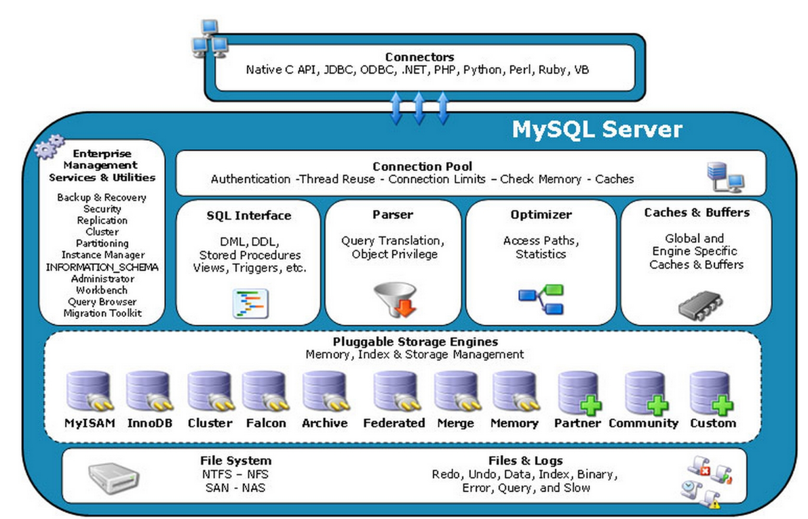

# MySQL架构介绍

​		和其它数据库相比，MySQL有点与众不同，它的架构可以在多种不同场景中应用并发挥良好作用。主要体现在存储引擎的架构上，**插件式的存储引擎架构将查询处理和其它的系统任务以及数据的存储提取相分离**。这种架构可以根据业务的需求和实际需要选择合适的存储引擎。

## 1. 连接层

​		最上层是一些客户端和连接服务，包含本地socket通信和大多数基于客户端/服务端工具实现的类似于tcp/ip的通信。**主要完成一些类似于连接处理、授权认证、及相关的安全方案**。在该层上引入了线程池的概念，为通过认证安全接入的客户端提供线程。同样在该层上可以实现基于SSL的安全链接。服务器也会为安全接入的每个客户端验证它所具有的操作权限。

## 2. 服务层

​		第二层架构主要完成大部分的核心服务功能， 包括查询解析、分析、优化、缓存、以及所有的内置函数，所有跨存储引擎的功能也都在这一层实现，包括触发器、存储过程、视图等 

## 3.引擎层

​		存储引擎层，存储引擎真正的负责了MySQL中数据的存储和提取，服务器通过API与存储引擎进行通信。不同的存储引擎具有的功能不同，这样我们可以根据自己的实际需要进行选取。

## 4.存储层

​		数据存储层，主要是将数据存储在运行于该设备的文件系统之上，并完成与存储引擎的交互。

更符合程序员审美的MySQL服务器逻辑架构图   ↓ 

## 查询说明

mysql的查询流程大致是：

1. mysql客户端通过协议与mysql服务器建连接，发送查询语句，先检查查询缓存，如果命中，直接返回结果，否则进行语句解析
2. 有一系列预处理，比如检查语句是否写正确了，然后是查询优化（比如是否使用索引扫描，如果是一个不可能的条件，则提前终止），生成查询计划，然后查询引擎启动，开始执行查询，从底层存储引擎调用API获取数据，最后返回给客户端。怎么存数据、怎么取数据，都与存储引擎有关。
3. 然后，mysql默认使用的BTREE索引，并且一个大方向是，无论怎么折腾sql，至少在目前来说，mysql最多只用到表中的一个索引。

