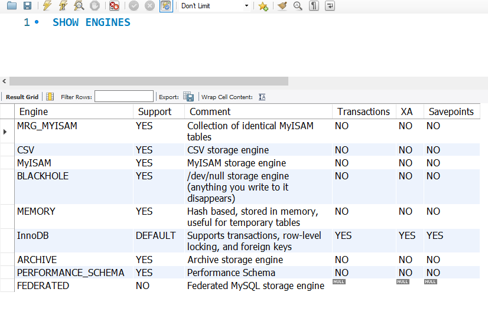

# Mysql Storage Engines

​		存储引擎是MySQL的组件，用于处理不同表类型的SQL操作。不同的存储引擎提供不同的存储机制、索引技巧、锁定水平等功能，使用不同的存储引擎，还可以获得特定的功能。

使用哪一种引擎可以灵活选择，**<font color=red>一个数据库中多个表可以使用不同引擎以满足各种性能和实际需求</font>**，使用合适的存储引擎，将会提高整个数据库的性能 。

 MySQL服务器使用可插拔的存储引擎体系结构，可以从运行中的MySQL服务器加载或卸载存储引擎 。

> [MySQL 5.7 可供选择的存储引擎](https://dev.mysql.com/doc/refman/5.7/en/storage-engines.html)

### 查看存储引擎

```mysql
-- 查看支持的存储引擎
SHOW ENGINES

-- 查看默认存储引擎
SHOW VARIABLES LIKE 'storage_engine

--查看具体某一个表所使用的存储引擎，这个默认存储引擎被修改了！
show create table tablename

--准确查看某个数据库中的某一表所使用的存储引擎
show table status like 'tablename'
show table status from database where name="tablename"
```





### 设置存储引擎

```mysql
-- 建表时指定存储引擎。默认的就是INNODB，不需要设置
CREATE TABLE t1 (i INT) ENGINE = INNODB;
CREATE TABLE t2 (i INT) ENGINE = CSV;
CREATE TABLE t3 (i INT) ENGINE = MEMORY;

-- 修改存储引擎
ALTER TABLE t ENGINE = InnoDB;

-- 修改默认存储引擎，也可以在配置文件my.cnf中修改默认引擎
SET default_storage_engine=NDBCLUSTER;
```

 默认情况下，每当CREATE TABLE或ALTER TABLE不能使用默认存储引擎时，都会生成一个警告。为了防止在所需的引擎不可用时出现令人困惑的意外行为，可以启用`NO_ENGINE_SUBSTITUTION SQL`模式。如果所需的引擎不可用，则此设置将产生错误而不是警告，并且不会创建或更改表 


### 常用存储引擎

#### InnoDB

**InnoDB是MySQL5.7 默认的存储引擎，主要特性有**

- InnoDB存储引擎维护自己的缓冲池，在访问数据时将表和索引数据缓存在主内存中 

- 支持事务

- 支持外键

- B-Tree索引

- 不支持集群

- 聚簇索引

- 行锁

- 支持地理位置的数据类型和索引

  

#### MyISAM

 每个MyISAM表存储在磁盘上的三个文件中 。这些文件的名称以表名开头，并有一个扩展名来指示文件类型 。

`.frm`文件存储表的格式。 `.MYD` (`MYData`) 文件存储表的数据。 `.MYI` (`MYIndex`) 文件存储索引。

 **MyISAM表具有以下特征** 

- 每个MyISAM表最大索引数是64，这可以通过重新编译来改变。每个索引最大的列数是16
- 每个MyISAM表都支持一个`AUTO_INCREMENT`的内部列。当执行`INSERT`或者`UPDATE`操作的时候，MyISAM自动更新这个列，这使得`AUTO_INCREMENT`列更快。
-  当把删除和更新及插入操作混合使用的时候，动态尺寸的行产生更少碎片。这要通过合并相邻被删除的块，若下一个块被删除，就扩展到下一块自动完成 

- MyISAM支持**并发插入**
- **可以将数据文件和索引文件放在不同物理设备上的不同目录中**，以更快地使用数据目录和索引目录表选项来创建表 
- BLOB和TEXT列可以被索引
- **NULL被允许在索引的列中**，这个值占每个键的0~1个字节
- 每个字符列可以有不同的字符集
- **`MyISAM` 表使用 B-tree 索引**
- MyISAM表的行最大限制为  (2^32)^2 (1.844E+19)
- 大文件（达到63位文件长度）在支持大文件的文件系统和操作系统上被支持 
- 键的最大长度为1000字节，这也可以通过重新编译来改变，对于键长度超过250字节的情况，一个超过1024字节的键将被用上

- VARCHAR支持固定或动态记录长度
- 表中VARCHAR和CHAR列的长度总和有可能达到64KB 
- 任意长度的唯一约束

- <small>All data values are stored with the low byte first. This makes the data machine and operating system independent. </small>

- <small> All numeric key values are stored with the high byte first to permit better index compression</small> 

  todo：最后两条没搞懂啥意思


### 存储引擎对比

| 对比项   | MyISAM                                                   | InnoDB                                                       |
| -------- | -------------------------------------------------------- | ------------------------------------------------------------ |
| 主外键   | 不支持                                                   | 支持                                                         |
| 事务     | 不支持                                                   | 支持                                                         |
| 行表锁   | 表锁，即使操作一条记录也会锁住整个表，不适合高并发的操作 | 行锁,操作时只锁某一行，不对其它行有影响，<br/>适合高并发的操作 |
| 缓存     | 只缓存索引，不缓存真实数据                               | 不仅缓存索引还要缓存真实数据，对内存要求较高，而且内存大小对性能有决定性的影响 |
| 表空间   | 小                                                       | 大                                                           |
| 关注点   | 性能                                                     | 事务                                                         |
| 默认安装 | 是                                                       | 是                                                           |

 

官方提供的多种引擎对比

| Feature                                    | MyISAM       | Memory           | InnoDB       | Archive      | NDB          |
| ------------------------------------------ | ------------ | ---------------- | ------------ | ------------ | ------------ |
| **B-tree indexes**                         | Yes          | Yes              | Yes          | No           | No           |
| **Backup/point-in-time recovery** (note 1) | Yes          | Yes              | Yes          | Yes          | Yes          |
| **Cluster database support**               | No           | No               | No           | No           | Yes          |
| **Clustered indexes**                      | No           | No               | Yes          | No           | No           |
| **Compressed data**                        | Yes (note 2) | No               | Yes          | Yes          | No           |
| **Data caches**                            | No           | N/A              | Yes          | No           | Yes          |
| **Encrypted data**                         | Yes (note 3) | Yes (note 3)     | Yes (note 4) | Yes (note 3) | Yes (note 3) |
| **Foreign key support**                    | No           | No               | Yes          | No           | Yes (note 5) |
| **Full-text search indexes**               | Yes          | No               | Yes (note 6) | No           | No           |
| **Geospatial data type support**           | Yes          | No               | Yes          | Yes          | Yes          |
| **Geospatial indexing support**            | Yes          | No               | Yes (note 7) | No           | No           |
| **Hash indexes**                           | No           | Yes              | No (note 8)  | No           | Yes          |
| **Index caches**                           | Yes          | N/A              | Yes          | No           | Yes          |
| **Locking granularity**                    | Table        | Table            | Row          | Row          | Row          |
| **MVCC**                                   | No           | No               | Yes          | No           | No           |
| **Replication support** (note 1)           | Yes          | Limited (note 9) | Yes          | Yes          | Yes          |
| **Storage limits**                         | 256TB        | RAM              | 64TB         | None         | 384EB        |
| **T-tree indexes**                         | No           | No               | No           | No           | Yes          |
| **Transactions**                           | No           | No               | Yes          | No           | Yes          |
| **Update statistics for data dictionary**  | Yes          | Yes              | Yes          | Yes          | Yes          |


