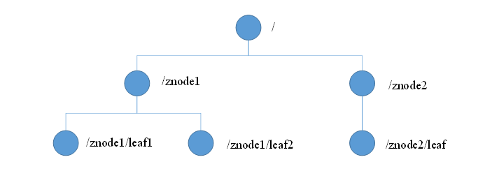
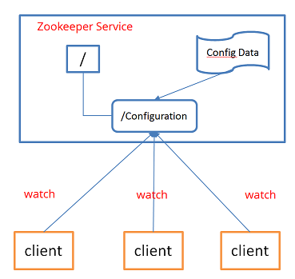
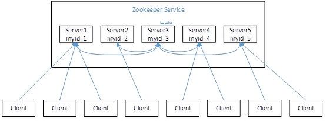
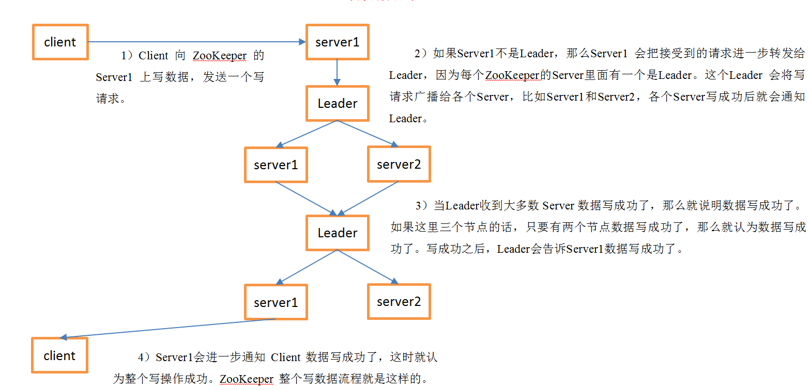

> zookeeper虽然在项目里有用过，奈何我要当大牛，所以要深入了解下，要把Zookeeper也放到知识库里，看了好多博客，感觉大部分都是基于《从Paxos到ZooKeeper 分布式一致性原理与实践》写的，所以自己读了一遍，加上看的其他文章和项目中的使用，做个整理。加油，奥利给！
>
> 文章收录在 GitHub [JavaEgg](https://github.com/Jstarfish/JavaEgg) 中，N线互联网开发必备兵器库，欢迎 star+指导


## 直击面试

eureka和zookeeper区别


## 前言

看面试要求老写着「熟悉分布式技术」，之前搞 “XXX管理系统” 的时候，我都不知道分布式系统是个啥。**分布式系统是一个硬件或软件组件分布在不同的网络计算机中上，彼此之间仅仅通过消息传递进行通信和协调的系统**。

计算机系统从集中式到分布式的变革伴随着包括**分布式网络**、**分布式事务**、**分布式数据一致性**等在内的一系列问题和挑战，同时也催生了一大批诸如**`ACID`**、**`CAP`**和**`BASE`**等经典理论的快速发展。

为了解决分布式一致性问题，涌现出了一大批经典的一致性协议和算法，最为著名的就是二阶段提交协议（2PC），三阶段提交协议（3PC）和`Paxos`算法。`Zookeeper`的一致性是通过基于 `Paxos` 算法的 `ZAB` 协议完成的。文末再说这部分内容。


## 1. 概述

ZooKeeper是Apache软件基金会的一个软件项目，它为大型「**分布式计算**」提供开源的分布式配置服务、同步服务和命名注册。

Zookeeper最早起源于雅虎研究院的一个研究小组。在当时，研究人员发现，在雅虎内部很多大型系统基本都需要依赖一个类似的系统来进行分布式协调，但是这些系统往往都存在分布式单点问题。所以，雅虎的开发人员就试图开发一个通用的无单点问题的**分布式协调框架**，以便让开发人员将精力集中在处理业务逻辑上，Zookeeper就这样诞生了。后来捐赠给了 `Apache` ，现已成为 `Apache` 顶级项目。


### 1.1 特性


1. Zookeeper：一个领导者（leader），多个跟随者（follower）组成的集群。

2. Leader负责进行投票的发起和决议，更新系统状态。

3. Follower用于接收客户请求并向客户端返回结果，在选举Leader过程中参与投票。

4. 集群中只要有半数以上节点存活，Zookeeper集群就能正常服务。

5. 全局数据一致（单一视图）：每个server保存一份相同的数据副本，client无论连接到哪个server，数据都是一致的。

6. **顺序一致性：** 从同一客户端发起的事务请求，最终将会严格地按照顺序被应用到 ZooKeeper 中去。

7. **原子性：** 所有事务请求的处理结果在整个集群中所有机器上的应用情况是一致的，也就是说，要么整个集群中所有的机器都成功应用了某一个事务，要么都没有应用。

8. **实时性**，在一定时间范围内，client能读到最新数据。

9. **可靠性：** 一旦一次更改请求被应用，更改的结果就会被持久化，直到被下一次更改覆盖。

   

### 1.2 设计目标

- **简单的数据结构** ：Zookeeper 使得分布式程序能够通过一个共享的树形结构的名字空间来进行相互协调，即Zookeeper 服务器内存中的数据模型由一系列被称为`ZNode`的数据节点组成，Zookeeper 将全量的数据存储在内存中，以此来提高服务器吞吐、减少延迟的目的。
- **可以构建集群** ： Zookeeper 集群通常由一组机器构成，组成 Zookeeper 集群的每台机器都会在内存中维护当前服务器状态，并且每台机器之间都相互通信。
- **顺序访问** ： 对于来自客户端的每个更新请求，Zookeeper 都会**分配一个全局唯一的递增编号**，这个编号反映了所有事务操作的先后顺序。
- **高性能** ：Zookeeper 和 Redis 一样全量数据存储在内存中，100%读请求压测QPS 12-13W


### 1.3 数据结构

Zookeeper 数据模型的结构与 Unix 文件系统的结构相似，整体上可以看做是一棵树，每个节点称作一个 **「ZNode」**。每个 ZNode 默认能存储 **1MB** 的数据，每个 ZNode 都可以通过其路径唯一标识。




### 1.4 应用场景

**ZooKeeper 是一个典型的分布式数据一致性解决方案，分布式应用程序可以基于 ZooKeeper 实现诸如数据发布/订阅、负载均衡、命名服务、分布式协调/通知、集群管理、Master 选举、分布式锁和分布式队列等功能** 

#### 统一命名服务

在分布式系统中，通过使用命名服务，客户端应用能够根据指定名字来获取资源或服务的地址，提供者等信息。被命名的实体通常可以是集群中的机器，提供的服务地址，进程对象等等——这些我们都可以统称他们为名字（Name）。其中较为常见的就是一些分布式服务框架（如RPC、RMI）中的服务地址列表。通过调用 Zookeeper 提供的创建节点的API，能够很容易创建一个全局唯一的 path，这个 path 就可以作为一个名称。 

#### 统一配管理

1. 分布式环境下，配置文件管理和同步是一个常见问题

   - 一个集群中，所有节点的配置信息是一致的，比如 Hadoop 集群、集群中的数据库配置信息等全局配置

   - 对配置文件修改后，希望能够快速同步到各个节点上。

2. 配置管理可交由ZooKeeper实现

   - 可将配置信息写入ZooKeeper上的一个Znode
   - 各个节点监听这个Znode
   - 一旦Znode中的数据被修改，ZooKeeper将通知各个节点



#### 统一集群管理

1. 分布式环境中，实时掌握每个节点的状态是必要的，比如我们要知道集群中各机器状态、收集各个机器的运行时状态数据、服务器动态上下线等。

2. 交由 ZooKeeper 实现的方式
   - 可将节点信息写入 ZooKeeper 上的一个 Znode
   - 监听这个 Znode 可获取它的实时状态变化

#### 软负载均衡

分布式系统中，负载均衡是一种很普遍的技术，可以是硬件的负载均衡，如 F5，也可以是软件的负载，我们熟知的 Nginx，或者这里介绍的 Zookeeper


#### 分布式协调/通知

Zookeeper 中特有的 「**Watcher**」 注册与异步通知机制，能够很好的实现分布式环境下不同机器，甚至不同系统之间的协调和通知，从而实现对数据变更的实时处理。

#### Master选举

利用 Zookeeper 的强一致性，能够很好的保证在分布式高并发情况下节点的创建一定是全局唯一的，即 Zookeeper 将会保证客户端无法重复创建一个已经存在的数据节点。Zookeeper通过这种节点唯一的特性，可以创建一个 Master 节点，其他客户端 Watcher 监控当前 Master 是否存活，一旦 Master 挂了，其他机器再创建这样的一个 Master 节点，用来重新选举。

#### 分布式锁

分布式锁，这个主要得益于 ZooKeeper 为我们保证了数据的强一致性。

锁服务可以分为两类，一个是**保持独占**，另一个是**控制时序**。 

所谓保持独占，就是所有试图来获取这个锁的客户端，最终只有一个可以成功获得这把锁。通常的做法是把zk上的一个 znode 看作是一把锁，通过`create znode`的方式来实现。所有客户端都去创建 `/distribute_lock` 节点，最终成功创建的那个客户端也即拥有了这把锁。 

控制时序，就是所有视图来获取这个锁的客户端，最终都是会被安排执行，只是有个全局时序了。做法和上面基本类似，只是这里 `/distribute_lock` 已半预先存在，客户端在它下面创建临时有序节点（这个可以通过节点的属性控制：`CreateMode.EPHEMERAL_SEQUENTIAL`来指定）。Zk的父节点（`/distribute_lock`）维持一份sequence，保证子节点创建的时序性，从而也形成了每个客户端的全局时序。

个人感觉还是用 Redis 实现分布式锁更加方便。


## 2. Hello Zookeeper

Zookeeper有两种运行模式：集群模式和单机模式。自己研究又没有机器，就单机练习下，当然也可以用伪集群。

### 2.1 本地模式安装部署

#### 1．安装前准备

1. 安装Jdk
2. 拷贝或下载 Zookeeper 安装包到 Linux 系统下(这里有个小问题，如果你下载zookeeper版本是3.5+ 的话，要下载 bin.tar.gz，愚笨的我最先没看到官网说明，一顿操作各种报错找不到 Main 方法)
3. 解压到指定目录

```shell
tar -zxvf apache-zookeeper-3.5.6-bin.tar.gz
```

#### 2．配置修改

1. 将 zookeeper-3.5.6/conf 这个路径下的 `zoo_sample.cfg` 修改为 `zoo.cfg` ；

```shell
mv zoo_sample.cfg zoo.cfg
```

3. 打开 zoo.cfg 文件，修改 dataDir 路径：

```
dataDir=XXX/zookeeper-3.5.6/zkData
```

4. 在zookeeper-3.5.6/ 这个目录上创建 zkData 文件夹

```shell
 mkdir zkData
```

#### 3．操作Zookeeper

1. 启动Zookeeper

```shell
bin/zkServer.sh start
```

2. 查看进程是否启动

```shell
jps
4020 Jps
4001 QuorumPeerMain
```

3. 查看状态：

```shell
bin/zkServer.sh status
```

4. 启动客户端：

```shell
bin/zkCli.sh
```

5. 退出客户端：

```shell
quit
```

6. 停止Zookeeper

```shell
bin/zkServer.sh stop
```


### 2.2 配置参数解读

在 Zookeeper 的设计中，如果是集群模式，那所有机器上的 zoo.cfg 文件内容应该都是一致的。

Zookeeper 中的配置文件 zoo.cfg 中参数含义解读如下：

- tickTime =2000：通信心跳数，Zookeeper 服务器与客户端心跳时间，单位毫秒

  Zookeeper 使用的基本时间，服务器之间或客户端与服务器之间维持心跳的时间间隔，也就是每个 tickTime时间就会发送一个心跳，时间单位为毫秒。

  它用于心跳机制，并且设置最小的 session 超时时间为两倍心跳时间。(session的最小超时时间是2*tickTime)

- initLimit =10：主从初始通信时限，集群中的 Follower 跟随者服务器与 Leader 领导者服务器之间初始连接时能容忍的最多心跳数（tickTime的数量），用它来限定集群中的 Zookeeper 服务器连接到 Leader 的时限。

- syncLimit =5：主从同步通信时限，集群中 Leader 与 Follower 之间的最大响应时间单位，假如响应超过`syncLimit * tickTime`，Leader 认为Follwer 死掉，从服务器列表中删除 Follwer。

- dataDir：数据文件目录+数据持久化路径。

- clientPort =2181：客户端连接端口。


### 2.3 概念

- **ZooKeeper 本身就是一个分布式程序（只要半数以上节点存活，ZooKeeper 就能正常服务）。**
- **为了保证高可用，最好是以集群形态来部署 ZooKeeper，这样只要集群中大部分机器是可用的（能够容忍一定的机器故障），那么 ZooKeeper 本身仍然是可用的。**
- **ZooKeeper 将数据保存在内存中，这也就保证了高吞吐量和低延迟**（但是内存限制了能够存储的容量不太大，此限制也是保持 znode 中存储的数据量较小的进一步原因）。
- **ZooKeeper 是高性能的。 在“读”多于“写”的应用程序中尤其的高性能，因为“写”会导致所有的服务器间同步状态。**（“读”多于“写”是协调服务的典型场景。）
- **ZooKeeper 有临时节点的概念。 当创建临时节点的客户端会话一直保持活动，临时节点就一直存在。而当会话终结时，临时节点被删除。持久节点是指一旦这个 ZNode 被创建了，除非主动进行 ZNode 的移除操作，否则这个 ZNode 将一直保存在 Zookeeper 上。**
- ZooKeeper 底层其实只提供了两个功能：① 管理（存储、读取）用户程序提交的数据；② 为用户程序提交数据节点监听服务。

#### 2.3.1 会话（Session）

Session 指的是 ZooKeeper 服务器与客户端会话。

**在 ZooKeeper 中，一个客户端连接是指客户端和服务器之间的一个 TCP 长连接**。客户端启动的时候，首先会与服务器建立一个 TCP 连接，从第一次连接建立开始，客户端会话的生命周期也开始了。**通过这个连接，客户端能够通过心跳检测与服务器保持有效的会话，也能够向 Zookeeper 服务器发送请求并接受响应，同时还能够通过该连接接收来自服务器的 Watch 事件通知。** Session 的 `sessionTimeout` 值用来设置一个客户端会话的超时时间。当由于服务器压力太大、网络故障或是客户端主动断开连接等各种原因导致客户端连接断开时，**只要在sessionTimeout 规定的时间内能够重新连接上集群中任意一台服务器，那么之前创建的会话仍然有效。**

在为客户端创建会话之前，服务端首先会为每个客户端都分配一个 sessionID。由于 sessionID 是 Zookeeper 会话的一个重要标识，许多与会话相关的运行机制都是基于这个 sessionID 的，因此，无论是哪台服务器为客户端分配的 sessionID，都务必保证全局唯一。

#### 2.3.2 数据节点（Znode）

在谈到分布式的时候，我们通常说的“节点"是指组成集群的每一台机器。然而，在 Zookeeper 中，“节点"分为两类，第一类同样是指构成集群的机器，我们称之为「机器节点」；第二类则是指数据模型中的数据单元，我们称之为「数据节点」一一ZNode。

Zookeeper 将所有数据存储在内存中，数据模型是一棵树（Znode Tree)，由斜杠（/）进行分割的路径，就是一个 Znode，例如/foo/path1。每个 Znode 上都会保存自己的数据内容，同时还会保存一系列属性信息。

**在 Zookeeper 中，Znode 可以分为持久节点和临时节点两类**。所谓持久节点是指一旦这个 ZNode 被创建了，除非主动进行 ZNode 的移除操作，否则这个 ZNode 将一直保存在 Zookeeper 上。而临时节点就不一样了，它的生命周期和客户端会话绑定，一旦客户端会话失效，那么这个客户端创建的所有临时节点都会被移除。另外，ZooKeeper 还允许用户为每个节点添加一个特殊的属性：**SEQUENTIAL。**一旦节点被标记上这个属性，那么在这个节点被创建的时候，Zookeeper 会自动在其节点名后面追加上一个整型数字，这个整型数字是一个由父节点维护的自增数字。

#### 2.3.3 版本

Zookeeper 的每个 ZNode 上都会存储数据，对应于每个 ZNode，Zookeeper 都会为其维护一个叫作 **Stat** 的数据结构，Stat 中记录了这个 ZNode 的三个数据版本，分别是 version（当前ZNode的版本）、cversion（当前ZNode 子节点的版本）和 aversion（当前ZNode的ACL版本）。

#### 2.3.4 事件监听器（Watcher）

Zookeeper 允许用户在指定节点上注册一些 Watcher，并且在一些特定事件触发的时候，ZooKeeper 服务端会将事件通知到感兴趣的客户端上去，**该机制是 Zookeeper实现分布式协调服务的重要特性**。

#### 2.3.5 ACL

Zookeeper 采用 ACL（Access Control Lists）策略来进行权限控制，类似于 UNIX 文件系统的权限控制。Zookeeper 定义了如下5种权限。

- **CREATE**: 创建子节点的权限
- **READ**: 获取节点数据和子节点列表的权限
- **WRITE**: 更新节点数据的权限
- **DELETE**: 删除子节点的权限
- **ADMIN**: 设置节点ACL的权限

其中尤其需要注意的是，CREATE 和 DELETE 这两种权限都是针对子节点的权限控制。


## 3. Zookeeper内部原理

### 3.1 选举机制

1. 半数机制：集群中半数以上机器存活，集群可用。所以 Zookeeper 适合安装奇数台服务器。
2. Zookeeper 虽然在配置文件中并没有指定 Master 和 Slave。但是，Zookeeper 工作时，是有一个节点为Leader，其他则为 Follower，Leader 是通过内部的选举机制临时产生的。
3. 以一个简单的例子来说明整个选举的过程。

假设有五台服务器组成的Zookeeper集群，它们的id从1-5，同时它们都是最新启动的，也就是没有历史数据，在存放数据量这一点上，都是一样的。假设这些服务器依序启动，来看看会发生什么，如下图所示。



1. 服务器1启动，此时只有它一台服务器启动了，它发出去的报文没有任何响应，所以它的选举状态一直是LOOKING 状态。
2. 服务器2启动，它与最开始启动的服务器1进行通信，互相交换自己的选举结果，由于两者都没有历史数据，所以id值较大的服务器2胜出，但是由于没有达到超过半数以上的服务器都同意选举它(这个例子中的半数以上是3)，所以服务器1、2还是继续保持LOOKING状态。
3. 服务器3启动，根据前面的理论分析，服务器3成为服务器1、2、3中的老大，而与上面不同的是，此时有三台服务器选举了它，所以它成为了这次选举的Leader。
4. 服务器4启动，根据前面的分析，理论上服务器4应该是服务器1、2、3、4中最大的，但是由于前面已经有半数以上的服务器选举了服务器3，所以它只能接收当小弟的命了。
5. 服务器5启动，同4一样当小弟。

### 3.2 节点类型

Zookeeper 的视图结构和标准的 Unix 文件系统非常类似，但没有引入传统文件系统的目录和文件等概念，而是使用"数据节点"概念 ZNode。Znode 是Zookeeper 中数据的最小单元，每个 ZNode 上都可以保存数据，同时还可以挂载子节点，因此构成了一个层次化的命名空间，我们称为树。

每个节点都是有生命周期的，生命周期的长短取决于数据节点的节点类型。节点类型可分为持久节点、临时节点和顺序节点三大类。

   

### 3.3 Stat 结构体

 Znodes 维护一个 stat 结构，其中包含数据更改、acl更改的版本号、时间戳等。 

| 状态属性       | 说明                                                         |
| -------------- | ------------------------------------------------------------ |
| czxid          | 创建节点的事务zxid。 每次修改ZooKeeper状态都会收到一个zxid形式的时间戳，也就是ZooKeeper事务ID。事务ID是ZooKeeper中所有修改总的次序。每个修改都有唯一的zxid，如果zxid1小于zxid2，那么zxid1在zxid2之前发生 |
| ctime          | znode被创建的毫秒数(从1970年开始)                            |
| mzxid          | znode最后更新的事务zxid                                      |
| mtime          | znode最后修改的毫秒数(从1970年开始)                          |
| pzxid          | znode最后更新的子节点zxid                                    |
| version        | 数据节点版本号                                               |
| cversion       | 子节点版本号，znode子节点修改次数                            |
| aversion       | znode访问控制列表的变化号                                    |
| ephemeralOwner | 如果是临时节点，这个是znode拥有者的session id。如果不是临时节点则是0 |
| dataLength     | znode的数据长度                                              |
| numChildren    | znode子节点数量                                              |

### 3.4 Watcher 监听器原理

在 Zookeeper 中，引入了 Watcher 机制来实现分布式的通知功能。

监听原理详解：

1. 首先要有一个main()线程
2. 在main线程中创建Zookeeper客户端，这时就会创建两个线程，一个负责网络连接通信（connet），一个负责监听（listener）。
3. 通过connect线程将注册的监听事件发送给Zookeeper。
4. 在Zookeeper的注册监听器列表中将注册的监听事件添加到列表中。
5. Zookeeper监听到有数据或路径变化，就会将这个消息发送给listener线程。
6. listener线程内部调用了process() 方法。

常见的监听

1. 监听节点数据的变化： get path [watch]
2.  监听子节点增减的变化： ls path [watch]


### 3.5 写数据流程

   


## 一致性协议

设计一个分布式系统必定会遇到一个问题—— **因为分区容忍性（partition tolerance）的存在，就必定要求我们需要在系统可用性（availability）和数据一致性（consistency）中做出权衡** 。这就是著名的 `CAP` 定理。


### 2PC

2PC，是 Two-Phase-Comimit 的缩写，即「**二阶段提交**」，是计算机网络尤其是数据库领域内，为了使基于分布式系统架构的所有节点在进行**事务处理**过程中能够保持原子性和一致性而设计的一种协议。

现在很多数据库都是采用的二阶段提交协议来完成**分布式事务**的处理。

二阶段，顾名思义就是分两个阶段处理事务，流程如下：

##### 阶段一：提交事务请求（”投票阶段“）

当要执行一个分布式事务的时候，事务发起者首先向协调者发起事务请求，然后协调者会给所有参与者发送 `prepare` 请求（其中包括事务内容）告诉参与者你们需要执行事务了，如果能执行我发的事务内容那么就先执行但不提交，执行后请给我回复。然后参与者收到 `prepare` 消息后，他们会开始执行事务（但不提交），并将 `Undo` 和 `Redo` 信息记入事务日志中，之后参与者就向协调者反馈是否准备好了

##### 阶段二：执行事务提交

协调者根据各参与者的反馈情况决定最终是否可以提交事务，如果反馈都是Yes，发送提交`commit`请求，参与者提交成功后返回 `Ack` 消息，协调者接收后就完成了。如果反馈是No 或者超时未反馈，发送 `Rollback` 请求，利用阶段一记录表的 `Undo` 信息执行回滚，并反馈给协调者`Ack` ，中断消息


#### 优缺点

优点：原理简单、实现方便。

缺点：

- **单点故障问题**，如果协调者挂了那么整个系统都处于不可用的状态了
- **阻塞问题**，即当协调者发送 `prepare` 请求，参与者收到之后如果能处理那么它将会进行事务的处理但并不提交，这个时候会一直占用着资源不释放，如果此时协调者挂了，那么这些资源都不会再释放了，这会极大影响性能
- **数据不一致问题**，比如当第二阶段，协调者只发送了一部分的 `commit` 请求就挂了，那么也就意味着，收到消息的参与者会进行事务的提交，而后面没收到的则不会进行事务提交，那么这时候就会产生数据不一致性问题

### 3PC

3PC，是 Three-Phase-Comimit 的缩写，即「**三阶段提交**」，是二阶段的改进版，将二阶段提交协议的“提交事务请求”过程一分为二。

##### 阶段一：CanCommit

协调者向所有参与者发送 `CanCommit` 请求，参与者收到请求后会根据自身情况查看是否能执行事务，如果可以则返回 YES 响应并进入预备状态，否则返回 NO

##### 阶段二：PreCommit

协调者根据参与者返回的响应来决定是否可以进行下面的 `PreCommit` 操作。如果上面参与者返回的都是 YES，那么协调者将向所有参与者发送 `PreCommit` 预提交请求，**参与者收到预提交请求后，会进行事务的执行操作，并将 Undo 和 Redo 信息写入事务日志中** ，最后如果参与者顺利执行了事务则给协调者返回成功的 `Ack` 响应。如果在第一阶段协调者收到了 **任何一个 NO** 的信息，或者 **在一定时间内** 并没有收到全部的参与者的响应，那么就会中断事务，它会向所有参与者发送中断请求 `abort`，参与者收到中断请求之后会立即中断事务，或者在一定时间内没有收到协调者的请求，它也会中断事务

##### 阶段三：DoCommit

这个阶段其实和 `2PC` 的第二阶段差不多，如果协调者收到了所有参与者在 `PreCommit` 阶段的 YES 响应，那么协调者将会给所有参与者发送 `DoCommit` 请求，**参与者收到 DoCommit 请求后则会进行事务的提交工作**，完成后则会给协调者返回响应，协调者收到所有参与者返回的事务提交成功的响应之后则完成事务。若协调者在 `PreCommit` 阶段 **收到了任何一个 NO 或者在一定时间内没有收到所有参与者的响应** ，那么就会进行中断请求的发送，参与者收到中断请求后则会 **通过上面记录的回滚日志** 来进行事务的回滚操作，并向协调者反馈回滚状况，协调者收到参与者返回的消息后，中断事务。


#### 优缺点

降低了参与者的阻塞范围，且能在单点故障后继续达成一致。

但是最重要的一致性并没有得到根本的解决，比如在 `PreCommit` 阶段，当一个参与者收到了请求之后其他参与者和协调者挂了或者出现了网络分区，这个时候收到消息的参与者都会进行事务提交，这就会出现数据不一致性问题。

### Paxos 算法

从「拜占庭将军问题」到「Paxos小岛的故事」诞生了 Paxos 算法。

`Paxos` 算法是基于**消息传递且具有高度容错特性的一致性算法**，是目前公认的解决分布式一致性问题最有效的算法之一，**其解决的问题就是在分布式系统中如何就某个值（决议）达成一致** 。

在 `Paxos` 中主要有三个角色，分别为 `Proposer提案者`、`Acceptor表决者`、`Learner学习者`。`Paxos` 算法和 `2PC` 一样，也有两个阶段，分别为 `Prepare` 和 `accept` 阶段。

在具体的实现中，一个进程可能同时充当多种角色。比如一个进程可能既是 Proposer 又是 Acceptor 又是Learner。Proposer 负责提出提案，Acceptor 负责对提案作出裁决（accept与否），learner 负责学习提案结果。

还有一个很重要的概念叫「**提案**」（Proposal）。最终要达成一致的 value 就在提案里。只要 Proposer 发的提案被半数以上的 Acceptor 接受，Proposer 就认为该提案里的 value 被选定了。Acceptor 告诉 Learner 哪个 value 被选定，Learner 就认为那个 value 被选定。

##### 阶段一：prepare 阶段

1. `Proposer` 负责提出 `proposal`，每个提案者在提出提案时都会首先获取到一个 **具有全局唯一性的、递增的提案编号N**，即在整个集群中是唯一的编号 N，然后将该编号赋予其要提出的提案，在**第一阶段是只将提案编号发送给所有的表决者**。

2. 如果一个 Acceptor 收到一个编号为 N 的 Prepare 请求，如果小于它已经响应过的请求，则拒绝，不回应或回复error。若 N 大于该 Acceptor 已经响应过的所有 Prepare 请求的编号（maxN），那么它就会将它**已经批准过的编号最大的提案**（如果有的话，如果还没有的accept提案的话返回{pok，null，null}）作为响应反馈给 Proposer，同时该 Acceptor 承诺不再接受任何编号小于 N 的提案

   eg：假定一个 Acceptor 已经响应过的所有 Prepare 请求对应的提案编号分别是1、2、...5和7，那么该 Acceptor 在接收到一个编号为8的 Prepare 请求后，就会将 7 的提案作为响应反馈给 Proposer。

##### 阶段二：accept 阶段

1. 如果一个 Proposer 收到半数以上 Acceptor 对其发出的编号为 N 的 Prepare 请求的响应，那么它就会发送一个针对 [N,V] 提案的 Accept 请求半数以上的 Acceptor。注意：V 就是收到的响应中编号最大的提案的 value，如果响应中不包含任何提案，那么 V 就由 Proposer 自己决定
2. 如果 Acceptor 收到一个针对编号为N的提案的Accept请求，只要该 Acceptor 没有对编号大于 N 的 Prepare 请求做出过响应，它就通过该提案。如果N小于 Acceptor 以及响应的 prepare 请求，则拒绝，不回应或回复error（当proposer没有收到过半的回应，那么他会重新进入第一阶段，递增提案号，重新提出prepare请求）
3. 最后是 Learner 获取通过的提案（有多种方式）


#### `paxos` 算法的死循环问题

其实就有点类似于两个人吵架，小明说我是对的，小红说我才是对的，两个人据理力争的谁也不让谁🤬🤬。

比如说，此时提案者 P1 提出一个方案 M1，完成了 `Prepare` 阶段的工作，这个时候 `acceptor` 则批准了 M1，但是此时提案者 P2 同时也提出了一个方案 M2，它也完成了 `Prepare` 阶段的工作。然后 P1 的方案已经不能在第二阶段被批准了（因为 `acceptor` 已经批准了比 M1 更大的 M2），所以 P1 自增方案变为 M3 重新进入 `Prepare` 阶段，然后 `acceptor` ，又批准了新的 M3 方案，它又不能批准 M2 了，这个时候 M2 又自增进入 `Prepare` 阶段。。。

就这样无休无止的永远提案下去，这就是 `paxos` 算法的死循环问题。


### ZAB

ZAB（Zookeeper Atomic Broadcast） 协议是为分布式分布式协调服务 Zookeeper 专门设计的一种支持**崩溃恢复的原子广播协议**。

在 Zookeeper 中，主要依赖 ZAB 协议来实现分布式数据一致性，基于该协议，ZooKeeper 实现了一种主备模式的系统架构来保持集群中各副本之间数据的一致性。

尽管 ZAB 不是 Paxos 的实现，但是 ZAB 也参考了一些 Paxos 的一些设计思想，比如：

- leader 向 follows 提出提案(proposal)
- leader 需要在达到法定数量(半数以上)的 follows 确认之后才会进行 commit
- 每一个 proposal 都有一个纪元(epoch)号，类似于 Paxos 中的选票(ballot)

#### `ZAB` 中的三个角色

 `ZAB` 中有三个主要的角色，`Leader 领导者`、`Follower跟随者`、`Observer观察者` 。

- `Leader` ：集群中 **唯一的写请求处理者** ，能够发起投票（投票也是为了进行写请求）。
- `Follower`：能够接收客户端的请求，如果是读请求则可以自己处理，**如果是写请求则要转发给 Leader 。在选举过程中会参与投票，有选举权和被选举权 。**
- **Observer ：就是没有选举权和被选举权的 Follower 。**

在 ZAB 协议中对 zkServer(即上面我们说的三个角色的总称) 还有两种模式的定义，分别是消息广播和崩溃恢复

#### **消息广播模式**


1. Leader从客户端收到一个事务请求（如果是集群中其他机器接收到客户端的事务请求，会直接转发个 Leader 服务器）
2. Leader 服务器生成一个对应的事务 Proposal，并为这个事务生成一个全局递增的唯一的ZXID（通过其 ZXID 来进行排序保证顺序性）
3. Leader 将这个事务发送给所有的 Follows 节点
4. Follower 节点将收到的事务请求加入到历史队列(Leader会为每个 Follower 分配一个单独的队列先进先出，顺序保证消息的因果关系)中，并发送ack给Leader
5. 当Leader收到超过半数 Follower 的 ack 消息，Leader会广播一个 commit 消息
6. 当 Follower 收到 commit 请求时，会判断该事务的 ZXID 是不是比历史队列中的任何事务的 ZXID 都小，如果是则提交，如果不是则等待比它更小的事务的 commit


#### **崩溃恢复模式**

ZAB 的原子广播协议在正常情况下运行良好，但天有不测风云，一旦 Leader 服务器挂掉或者由于网络原因导致与半数的 Follower 的服务器失去联系，那么就会进入崩溃恢复模式。整个恢复过程结束后需要选举出一个新的 Leader 服务器。

恢复模式大致可以分为四个阶段：选举、发现、同步、广播

1. 当leader崩溃后，集群进入选举阶段，开始选举出潜在的新leader(一般为集群中拥有最大ZXID的节点)
2. 进入发现阶段，follower与潜在的新leader进行沟通，如果发现超过法定人数的follower同意，则潜在的新leader将epoch加1，进入新的纪元。新的leader产生
3. 集群间进行数据同步，保证集群中各个节点的事务一致
4. 集群恢复到广播模式，开始接受客户端的写请求

##### **两个特性**

根据 ZAB 消息广播的过程可知，如果一个事务 Proposal 在一台机器上被处理成功，那么就应该在所有的机器上处理成功，哪怕机器出现故障。所以在崩溃恢复过程结束后，为了保证新选举出来的 Leader 服务器能正常工作，需要保证 2 个基本特性：

- 确保那些已经在 Leader 服务器上提交的事务最终被所有的服务器都提交
- 确保丢弃那些只在 Leader 服务上被提出的事务

首先看第一个特性：确保那些已经在 Leader 服务器上提交的事务最终被所有的服务器都提交。试想这么个场景：Leader 服务器在收到超半数的 ACK 返回响应后，本应该广播 commit 消息，但这时候 Leader 服务器挂掉了（Leader 服务器已经提交了事务？），这时候就会导致 Follower 服务器和 Leader 服务器数据不一致的情况。ZAB 协议就须确保这种况下，所有的 Follower 服务器也都成功提交该事物。

第二个特性：确保丢弃那些只在 Leader 服务上被提出的事务。试想这么个场景：Leader 服务器在生成 Proposal 后就挂掉了，其他的服务器都没收到该 Proposal。于是，当该机器再次加入集群中的时候，需要确保丢弃该事物 Proposal。

所以上面两个特性总结就是下面两句话：

- 提交已经被 Leader 提交的事务
- 丢弃已经被跳过的事务

基于这两个特性，如果让新选举出来的 Leader 具有最大的 ZXID 的事务 Proposal，那么就可以保证该 Leader 一定具有所有已提交的提案。更为重要的是，如果让具有最高 ZXID 的事务 Proposal 的机器来成为 Leader，就可以省去 Leader 服务器检查 Proposal 的提交和丢弃工作这一步操作了。

#### 数据同步

在完成 Leader 选举之后，在正式开始工作（即接收客户端的事务请求，然后提出新的提案）之前，Leader 服务器首先会确保事务日志中的所有 Proposal 是否都已经被集群中过半的机器提交了，即是否完成数据同步。

对于那些没有被 Follower 服务器提交的事务，Leader 会为每个 Follower 服务器准备一个队列，并将那些没有被各 Follower 服务器同步的事务已 Proposal 消息的形式逐个发送给 Follower 服务器，并在每一个 Proposal 消息后面紧接着再发送一个 commit 消息，以表示该事务已被提交。等到 Follower 服务器将所有未同步的事务 Proposal 都从 Leader 服务器上同步过来并应用到本地数据库，Leader 服务器就将该 Follower 服务器加入到真正可用的 Follower 列表中。

那 ZAB 是如何处理那些需要被丢弃的事务 Proposal 呢？ZXID 是一个 64 位的数字，其中低 32 位可看作是计数器，Leader 服务器每产生一个新的事务 Proposal 的时候，都会该计数器进行加 1 操作。而高 32 位表示 Leader 周期 epoch 的编号，每当选举一个新的 Leader 服务器，就会从该服务器本地的事务日志中最大 Proposal 的 ZXID 中解析出对应的 epoch 值，然后对其加 1 操作，这个值就作为新的 epoch 值，并将低 32 位初始化为 0 来开始生成新的 ZXID。

基于这样的策略，当一个包含上一个 Leader 周期中尚未提交的事务 Proposal 的服务器启动时，已 Follower 角色加入集群中之后，Leader 服务器会根据自己服务器上最后被提交的 Proposal 来和 Follower 服务器的 Proposal 进行比对，比对结果就是 Leader 会要求 Follower 进行一个回退操作——回退到一个确实已经被集群中过半机器提交的最新的事务 Proposal。

#### Master 选举实现细节

上文说过，新选举出来的 Leader 具有最大的 ZXID 的事务 Proposal，那这是怎么实现的呢？

ZAB 默认采用 TCP 版本的 FastLeaderElection 选举算法。在选举投票消息中包含了两个最基本的信息：所推举的服务器 SID 和 ZXID，分别表示被推举服务器的唯一标识（每台机器不一样）和事务 ID。假如投票信息为 （SID, ZXID）的形式。在第一次投票的时候，由于还无法检测集群其他机器的状态信息，因此每台机器都将自己作为被推举的对象来进行投票。每次对收到的投票，都是一个对投票信息（SID, ZXID）对比的过程，规则如下：

- 如果接收到的投票 ZXID 大于自己的 ZXID，就认可当前收到的投票，并再次将该投票发送出去。
- 如果 ZXID 小于自己的 ZXID，那么就坚持的投票，不做任何变更。
- 如果 ZXID 等于自己的 ZXID，再对比 SID，比自己大，就认可当前收到的投票，再将该投票发送出去；如果比自己小，那就坚持自己的投票，不做变更。

经过第二次投票后，集群中每台机器都会再次收到其他机器的投票，然后开始统计，如果一台机器收到超过了半数的相同投票，那么这个投票对应的 SID 机器即为 Leader。

简单来说，通常哪台服务器上的数据越新，那么越有可能成为 Leader。原因很简答，数据越新，也就越能够保证数据的恢复。当然，如果集群中有几个服务器具有相同的 ZXID，那么 SID 较大的那台服务器成为 Leader。


## 参考：

《从Paxos到ZooKeeper 分布式一致性原理与实践》

《[聊聊zookeeper的ZAB算法](https://blog.sunwaiting.com/2018/08/26/聊聊zookeeper的ZAB算法/)》

《[基础Paxos算法]([https://netium.gitlab.io/2018/09/25/%E5%9F%BA%E7%A1%80Paxos%E7%AE%97%E6%B3%95/](https://netium.gitlab.io/2018/09/25/基础Paxos算法/))》

《尚硅谷Zookeeper》

 https://zookeeper.apache.org/doc/ 

